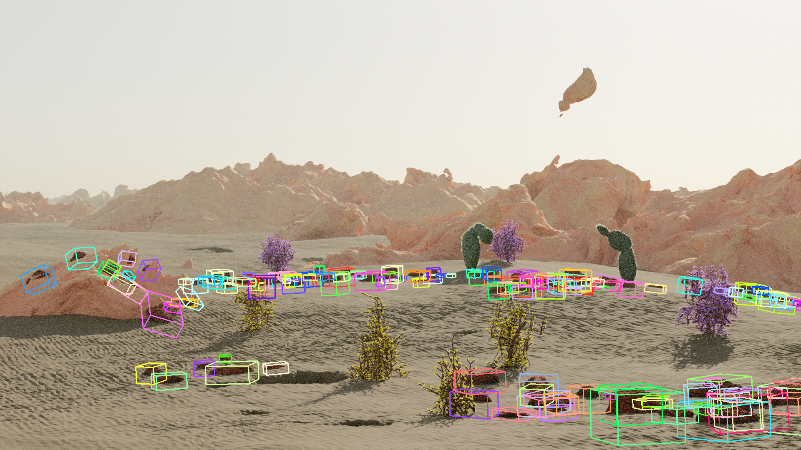

# Ground-Truth Annotations

## Default Annotations from Blender

Infinigen can produce some dense annotations using Blender's built-in render passes. Users may prefer to use these annotations over our extended annotation system's since it requires only the bare-minimum installation. It is also able to run without a GPU.

These annotations are produced when using the `--pipeline_configs opengl_gt` ground truth extraction config in [manage_datagen_jobs.py](/README.md#generate-images-in-one-command), or can be done manually as shown in the final step of the [Hello-World](/README.md#generate-a-scene-step-by-step) example.

### Specification

**Coming Soon**

## OpenGL-Based Annotation Pipeline

We also provide a separate pipeline for extracting the full set of annotations from each image or scene.

This section will allow you to use our own `--pipeline_configs opengl_gt` ground truth extraction config, which provides additional labels such as occlusion boundaries, sub-object segmentation, 3D flow and easy 3D bounding boxes. If you do not need these features, we recommend using the [default annotations](#default-annotations-from-blender). This section is intended for computer vision researchers and power-users. 

### Installation

```
git submodule init
git submodule update
sudo apt-get install libglm-dev libglew-dev libglfw3-dev libgles2-mesa-dev zlib1g-dev
```

If you do not have sudo access, you may attempt the following:
- install them manually set your $CPATH variables appropriately. 
- ask your administrator to install them on your behalf

Finally, run
```
bash install.sh opengl
```
Or, if you have already run `install.sh` earlier, you can run just
```
bash worldgen/tools/compile_opengl.sh
```

### Extended Hello-World

Continuing the [Hello-World](/README.md#generate-a-scene-step-by-step) example, we can produce the full set of annotations that Infinigen supports. Following step 3:

4. Export the geometry from blender to disk
```
$BLENDER -noaudio --background --python generate.py -- --seed 0 --task mesh_save -g desert simple --input_folder outputs/helloworld/fine --output_folder outputs/helloworld/saved_mesh
```
5. Generate dense annotations
```
../process_mesh/build/process_mesh --frame 1 -in outputs/helloworld/saved_mesh -out outputs/helloworld/frames
```
6. Summarize the file structure into a single JSON
```
python tools/summarize.py outputs/helloworld # creating outputs/helloworld/summary.json
```
7. (Optional) Select for a segmentation mask of certain semantic tags, e.g. cactus
```
python tools/ground_truth/segmentation_lookup.py outputs/helloworld 1 --query cactus
```

### Specification

**File structure:**

We provide a python script `summarize.py` which will aggregate all relevant output file paths into a JSON:
```
python tools/summarize.py <output-folder>
```
The resulting `<output-folder>/summary.json` will contains all file paths in the form:
```
{
    <type>: {
        <file-ext>: {
            <rig>: {
                <sub-cam>: {
                    <frame>: <file-path> 
                }
            }
        }
    }
}
```

`<rig>` and `<sub-cam>` are typically both "00" in the monocular setting; `<file-ext>` is typically "npy" or "png" for the the actual data and the visualization, respectively; `<frame>` is a 0-padded 4-digit number, e.g. "0013". `<type>` can be "SurfaceNormal", "Depth", etc. For example
`summary_json["SurfaceNormal"]["npy"]["00"]["00"]["0001"]` -> `'frames/SurfaceNormal_0001_00_00.npy'`

*Note: Currently our ground-truth has only been tested for the aspect-ratio 16-9.*

**Depth**

Depth is stored as a 2160 x 3840 32-bit floating point numpy array.

*Path:* `summary_json["Depth"]["npy"]["00"]["00"]["0001"]` -> `frames/Depth_0001_00_00.npy`

*Visualization:* `summary_json["Depth"]["png"]["00"]["00"]["0001"]` -> `frames/Depth_0001_00_00.png`

<p align="center">

</p>

The depth and camera parameters can be used to warp one image to another frame by running:
```
python tools/ground_truth/rigid_warp.py <folder> <first-frame> <second-frame>
```

**Surface Normals**

Surface Normals are stored as a 1080 x 1920 x 3 32-bit floating point numpy array.

*Path:* `summary_json["SurfaceNormal"]["npy"]["00"]["00"]["0001"]` -> `frames/SurfaceNormal_0001_00_00.npy`

*Visualization:* `summary_json["SurfaceNormal"]["png"]["00"]["00"]["0001"]` -> `frames/SurfaceNormal_0001_00_00.png`

<p align="center">

</p>

**Occlusion Boundaries**

Occlusion Boundaries are stored as a 2160 x 3840 png, with 255 indicating a boundary and 0 otherwise.

*Path/Visualization:* `summary_json["OcclusionBoundaries"]["png"]["00"]["00"]["0001"]` -> `frames/OcclusionBoundaries_0001_00_00.png`

<p align="center">

</p>

**Optical Flow / Scene Flow**

Optical Flow / Scene Flow is stored as a 2160 x 3840 x 3 32-bit floating point numpy array.

*Note: The values won't be meaningful if this is the final frame in a series, or in the single-view setting.*

Channels 1 & 2 are standard optical flow. Note that the units of optical flow are in pixels measured in the resolution of the *original image*. So if the rendered image is 1080 x 1920, you would want to average-pool this array by 2x.

Channel 3 is the depth change between this frame and the next.

To see an example of how optical flow can be used to warp one frame to the next, run

```
python tools/ground_truth/optical_flow_warp.py <folder> <frame-number>
```

*Path:* `summary_json["Flow3D"]["npy"]["00"]["00"]["0001"]` -> `frames/Flow3D_0001_00_00.npy`

*Visualization:* `summary_json["Flow3D"]["png"]["00"]["00"]["0001"]` -> `frames/ObjectSegmentation_0001_00_00.png`

**Optical Flow Occlusion**

The mask of occluded pixels for the aforementioned optical flow is stored as a 2160 x 3840 png, with 255 indicating a co-visible pixel and 0 otherwise.

*Note: This mask is computed by comparing the face-ids on the triangle meshes at either end of each flow vector. Infinigen meshes often contain multiple faces per-pixel, resulting in frequent false-negatives (negative=occluded). These false-negatives are generally distributed uniformly over the image (like salt-and-pepper noise), and can be reduced by max-pooling the occlusion mask down to the image resolution.*

*Path/Visualization:* `summary_json["Flow3DMask"]["png"]["00"]["00"]["0001"]` -> `frames/Flow3DMask_0001_00_00.png`

**Camera Intrinsics**

Infinigen renders images using a pinhole camera model. The resulting camera intrinsics for each frame are stored as a 3 x 3 numpy matrix.

*Path:* `summary_json["Camera Intrinsics"]["npy"]["00"]["00"]["0001"]` -> `saved_mesh/frame_0001/cameras/K_0001_00_00.npy`

**Camera Extrinsics**

The camera pose is stored as a 4 x 4 numpy matrix mapping from object coordinates to world coordinates.

As is standard in computer vision, the world coordinate system in the saved camera poses is +X -> Right, +Y -> Down, +Z Forward. This is opposed to how Blender internally represents geometry, with a flippped Y and Z axes.

*Path:* `summary_json["Camera Pose"]["npy"]["00"]["00"]["0001"]` -> `saved_mesh/frame_0001/cameras/T_0001_00_00.npy`

**Panoptic Segmentation and 3D Bounding Boxes**

Infinigen saves 3 types of semantic segmentation masks: 1) Object Segmentation 2) Tag Segmentation 3) Instance Segmentation

*Object Segmentation* distinguishes individual blender objects, and is stored as a 2160 x 3840 32-bit integer numpy array. The association between each integer in the mask and the associated object is stored in Objects_XXXX_XX_XX.json. The definition of "object" is imposed by Blender; generally large or complex objects such as the terrain, trees, animals are considered one object, while a large number of smaller objects (e.g. grass, coral) may be grouped together if they are using instanced-geometry under the hood.

*Tag Segmentation* distringuishes objects based on their semantic tags, and is stored as a 2160 x 3840 64-bit integer numpy array. Infinigen tags all vertices with an integer which can be associated to a list of semantic labels in `MaskTag.json`. Compared to Object Segmentation, Infinigen's tagging system is less automatic but much more flexible. Missing features in the tagging system are usually possible and straightforward to implement, wheras in the automaically generated Object Segmentation they are not. 

*Instance Segmentation* distinguishes individual instances of a single object from one another (e.g. separate blades of grass, separate ferns, etc.), and is stored as a 2160 x 3840 32-bit integer numpy array. Each integer in this mask is the *instance-id* for a particular instance, which is unique for that object as defined in the Object Segmentation mask. The list of **3D bounding boxes** for each instance are defined in the `Objects_XXXX_XX_XX.json`.

*paths:*

`summary_json["ObjectSegmentation"]["npy"]["00"]["00"]["0001"]` -> `frames/ObjectSegmentation_0001_00_00.npy`

`summary_json["TagSegmentation"]["npy"]["00"]["00"]["0001"]` -> `frames/TagSegmentation_0001_00_00.npy`

`summary_json["InstanceSegmentation"]["npy"]["00"]["00"]["0001"]` -> `frames/InstanceSegmentation_0001_00_00.npy`

`summary_json["Objects"]["json"]["00"]["00"]["0001"]` -> `frames/Objects_0001_00_00.json`

`summary_json["Mask Tags"][<frame>]` -> `fine/MaskTag.json`

*Visualization:*

`summary_json["ObjectSegmentation"]["png"]["00"]["00"]["0001"]` -> `frames/ObjectSegmentation_0001_00_00.png`

`summary_json["TagSegmentation"]["png"]["00"]["00"]["0001"]` -> `frames/TagSegmentation_0001_00_00.png`

`summary_json["InstanceSegmentation"]["png"]["00"]["00"]["0001"]` -> `frames/InstanceSegmentation_0001_00_00.png`

As an example, to visualize the 2D and 3D bounding boxes for objects with the *blender_rock* semantic tag in the hello world scene, run 
```
python tools/ground_truth/segmentation_lookup.py outputs/helloworld 1 --query blender_rock --boxes
python tools/ground_truth/bounding_boxes_3d.py outputs/helloworld 1 --query blender_rock
```
which will output
<p align="center">
 
</p>
By ommitting the --query flag, a list of available tags will be printed.

You can produce a mask for only *flower petals*:

```
python tools/ground_truth/segmentation_lookup.py outputs/helloworld 1 --query petal
```
<p align="center">

</p>
The benefit of our tagging system is that one can produce a segmentation mask for things which are not a distinct object, such as terrain attributes. For instance, we can highlight only *caves* or *warped rocks*

```
python tools/ground_truth/segmentation_lookup.py outputs/helloworld 1 --query cave
python tools/ground_truth/segmentation_lookup.py outputs/helloworld 1 --query warped_rocks
```
<p align="center">
 
</p>
