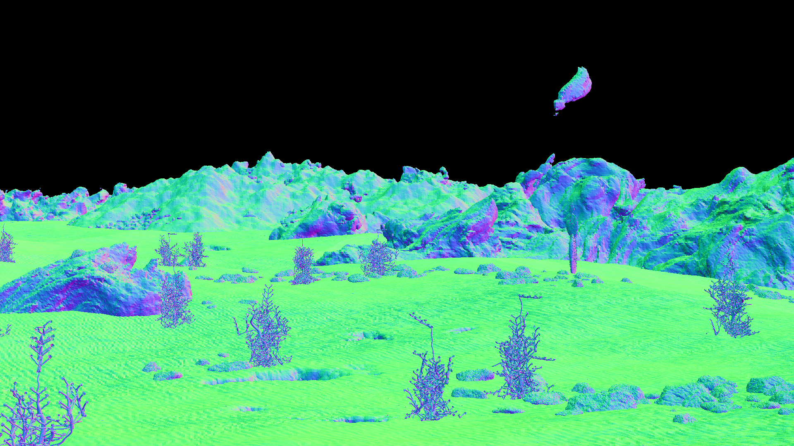
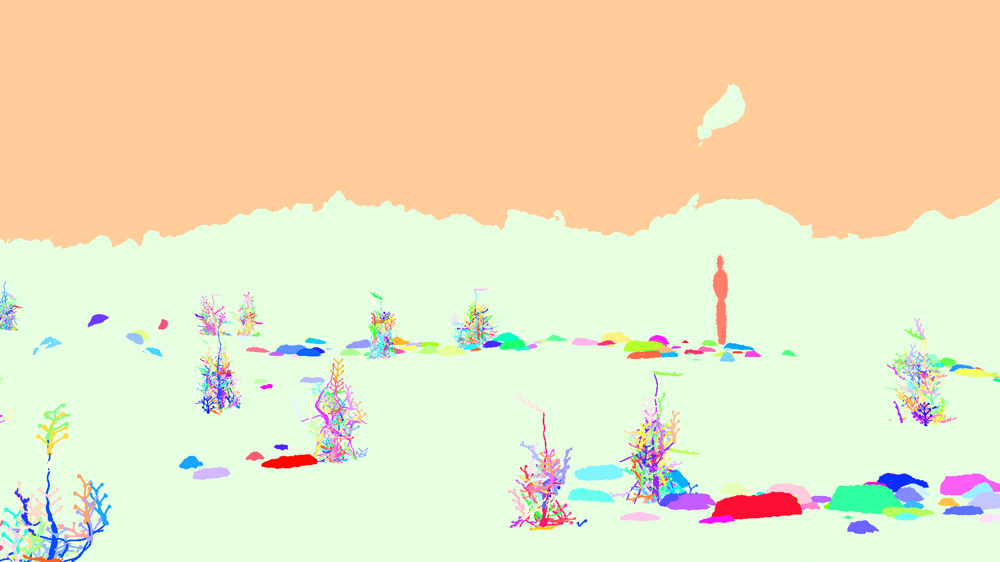

## [Infinigen: Infinite Photorealistic Worlds using Procedural Generation](https://infinigen.org)

Please visit our website, [https://infinigen.org](https://infinigen.org)

[](https://youtu.be/6tgspeI-GHY)

If you use Infinigen in your work, please cite our [academic paper]([https://arxiv.org/abs/2306.09310](https://arxiv.org/abs/2306.09310)):

<h3 align="center"><a href="https://arxiv.org/pdf/2306.09310">Infinite Photorealistic Worlds using Procedural Generation</a></h3>
<p align="center">
<a href="http://araistrick.com/">Alexander Raistrick</a>*, <a href="https://www.lahavlipson.com/">Lahav Lipson</a>*, <a href="https://mazeyu.github.io/">Zeyu Ma</a>* (*equal contribution, alphabetical order) <br>
<a href="https://www.cs.princeton.edu/~lm5483/">Lingjie Mei</a>, <a href="https://www.cs.princeton.edu/~mingzhew">Mingzhe Wang</a>, <a href="https://zuoym15.github.io/">Yiming Zuo</a>, <a href="https://kkayan.com/">Karhan Kayan</a>, <a href="https://hermera.github.io/">Hongyu Wen</a>, <a href="https://pvl.cs.princeton.edu/people.html">Beining Han</a>, <br>
<a href="https://pvl.cs.princeton.edu/people.html">Yihan Wang</a>, <a href="http://www-personal.umich.edu/~alnewell/index.html">Alejandro Newell</a>, <a href="https://heilaw.github.io/">Hei Law</a>, <a href="https://imankgoyal.github.io/">Ankit Goyal</a>, <a href="https://yangky11.github.io/">Kaiyu Yang</a>, <a href="http://www.cs.princeton.edu/~jiadeng">Jia Deng</a><br>
Conference on Computer Vision and Pattern Recognition (CVPR) 2023
</p>

```
@inproceedings{infinigen2023infinite,
  title={Infinite Photorealistic Worlds Using Procedural Generation},
  author={Raistrick, Alexander and Lipson, Lahav and Ma, Zeyu and Mei, Lingjie and Wang, Mingzhe and Zuo, Yiming and Kayan, Karhan and Wen, Hongyu and Han, Beining and Wang, Yihan and Newell, Alejandro and Law, Hei and Goyal, Ankit and Yang, Kaiyu and Deng, Jia},
  booktitle={Proceedings of the IEEE/CVF Conference on Computer Vision and Pattern Recognition},
  pages={12630--12641},
  year={2023}
}
```

## Installation

Installation is tested and working on the following platforms:

- Ubuntu 22.04.2 LTS 
    - GPUs options tested: CPU only, GTX-1080, RTX-2080, RTX-3090, RTX-4090 (Driver 525, CUDA 12.0)
    - RAM: 16GB
- MacOS Monterey & Ventura, Apple M1 Pro, 16GB RAM

We are working on support for rendering with AMD GPUs. Windows users should use [WSL2](https://ubuntu.com/tutorials/install-ubuntu-on-wsl2-on-windows-11-with-gui-support#1-overview). More instructions coming soon.

<details closed>
<summary><b>:warning: Errors with git pull / merge conflicts when migrating from v1.0.0 to v1.0.1</b></summary>
To properly display open-source line by line git credits for our team, we have switched to a new version of the repo which does not share commit history with the the version available from 6/17/2023 to 6/29/2023 date. We hope this will help open source contributors identify the current "code owner" or person best equipped to support you with issues you encounter with any particular lines of the codebase.

You will not be able to pull or merge infinigen v1.0.1 into a v1.0.0 repo without significant git expertise. If you have no ongoing changes, we recommend you clone a new copy of the repo. We apologize for any inconvenience, please make an issue if you have problems updating or need help migrating ongoing changes. We understand this change is disruptive, but it is one-time-only and will not occur in future versions. Now it is complete, we intend to iterate rapidly in the coming weeks, please see our [roadmap](https://infinigen.org/roadmap) and [twitter](https://twitter.com/PrincetonVL) for updates.
</details closed>

**Run these commands to get started**
```
git clone --recursive https://github.com/princeton-vl/infinigen.git
cd infinigen
conda create --name infinigen python=3.10
conda activate infinigen
bash install.sh
```
`install.sh` may take significant time to download Blender3.3 and compile all source files.

Ignore non-fatal warnings. See [Getting Help](#getting-help) for guidelines on posting github issues

Run the following or add it to your `~/.bashrc` (Linux/WSL) or `~/.bash_profile` (Mac)
```
# on Linux/WSL
export BLENDER="/PATH/TO/infinigen/blender/blender"
# on MAC
export BLENDER="/PATH/TO/infinigen/Blender.app/Contents/MacOS/Blender"
```

<details closed>
<summary><b>(Optional) Running Infinigen in a Docker Container</b></summary>

**Docker on Linux**

In `/infinigen/`
```
make docker-build
make docker-setup
make docker-run
```
To enable CUDA compilation, use `make docker-build-cuda` instead of `make docker-build`

To run without GPU passthrough use `make docker-run-no-gpu`

To run without OpenGL ground truth use `docker-run-no-opengl` 

To run without either, use `docker-run-no-gpu-opengl` 

Note: `make docker-setup` can be skipped if not using OpenGL.

Use `exit` to exit the container and `docker exec -it infinigen bash` to re-enter the container as needed. Remember to `conda activate infinigen` before running scenes.


**Docker on Windows**

Install [WSL2](https://infinigen.org/docs/installation/intro#setup-for-windows) and [Docker Desktop](https://www.docker.com/products/docker-desktop/), with "Use the WSL 2 based engine..." enabled in settings. Keep the Docker Desktop application open while running containers. Then follow instructions as above.

</details>

### "Hello World": Generate your first Infinigen scene

 :warning: **Known issue** : We are actively fixing an issue which causes commands not to be reproducible on many platforms. The same command may produce multiple rearranged scenes with different runtimes and memory requirements.

<p align="center">
  
  
  
  
</p>

This guide will show you how to generate an image and it's corresponding ground-truth, similar to those shown above.

#### Generate a scene step by step
Infinigen generates scenes by running multiple tasks (usually executed automatically, like in [Generate image(s) in one command](#generate-images-in-one-command)). Here we will run them one by one to demonstrate. These commands take approximately 10 minutes and 16GB of memory to execute on an M1 Mac or Linux Desktop.

```
cd worldgen
mkdir outputs

# Generate a scene layout
$BLENDER -noaudio --background --python generate.py -- --seed 0 --task coarse -g desert simple --output_folder outputs/helloworld/coarse

# Populate unique assets
$BLENDER -noaudio --background --python generate.py -- --seed 0 --task populate fine_terrain -g desert simple --input_folder outputs/helloworld/coarse --output_folder outputs/helloworld/fine

# Render RGB images
$BLENDER -noaudio --background --python generate.py -- --seed 0 --task render -g desert simple --input_folder outputs/helloworld/fine --output_folder outputs/helloworld/frames

# Render again for accurate ground-truth
$BLENDER -noaudio --background --python generate.py -- --seed 0 --task render -g desert simple --input_folder outputs/helloworld/fine --output_folder outputs/helloworld/frames -p render.render_image_func=@flat/render_image 
```

Output logs should indicate what the code is working on. Use `--debug` for even more detail. After each command completes you can inspect it's `--output_folder` for results, including running `$BLENDER outputs/helloworld/coarse/scene.blend` or similar to view blender files. We hide many meshes by default for viewport stability; to view them, click "Render" or use the UI to unhide them.

#### [Extended ground-truth & docmentation](./GroundTruthAnnotations.md)

We also provide a (optional) separate pipeline for extracting the full set of annotations from each image or scene. Refer to [GroundTruthAnnotations.md](./GroundTruthAnnotations.md) for compilation instructions, data format specifications and an extended "Hello World".

#### Generate image(s) in one command

We provide `tools/manage_datagen_jobs.py`, a utility which runs these or similar steps automatically.

```
python -m tools.manage_datagen_jobs --output_folder outputs/hello_world --num_scenes 1 --specific_seed 0
--configs desert simple --pipeline_configs local_16GB monocular blender_gt --pipeline_overrides LocalScheduleHandler.use_gpu=False
```

Ready to remove the guardrails? Try the following:
- Swap `desert` for any of `config/scene_types` to get different biome (or write your own crazy config!). You can also add in the name of any file in `configs`.
- Change the `--specific_seed` to any number to produce different scenes, or remove it and set --num_scenes 50 to try many random seeds.
- Remove `simple` to generate more detailed (but *EXPENSIVE*) scenes, as shown in the trailer.
- Read and customize `generate.py` to understand how infinigen works under the hood. 
- Append `-p compose_scene.grass_chance=1.0` to the first command to force grass (or any of `generate.py's` 'run_stage' asset names) to appear in the scene. You can modify the kwargs @gin.configurable() python function in the entire repo via this mechanism. 

`--configs` enables you to customize the random *distribution* of visual content. If you do not select any config in the folder `config/scene_types`, the code choose one for you at random. 

`--pipeline_configs` determines what compute resources will be used, and what render jobs are necessary for each scene. A list of configs are available in `tools/pipeline_configs`. You must pick one config to determine compute type (ie `local_64GB` or `slurm`) and one to determine the dataset type (such as `monocular` or `monocular_video`). Run `python -m tools.manage_datagen_jobs --help` for more options related to dataset generation.

If you intend to use CUDA-accelerated terrain (`--pipeline_configs cuda_terrain`), you must run `install.sh` on a CUDA-enabled machine. 

Infinigen uses [Google's "Gin Config"](https://github.com/google/gin-config) heavily, and we encourage you to consult their documentation to familiarize yourself with its capabilities.

<details closed>
<summary><b>:bulb: Generating high quality videos / Avoiding terrain aliasing</b></summary>

To render high quality videos as shown in the intro video, we ran commands similar to the following, on our SLURM cluster.

```
python -m tools.manage_datagen_jobs --output_folder outputs/my_videos --num_scenes 500 \
    --pipeline_config slurm monocular_video cuda_terrain opengl_gt \
    --cleanup big_files --warmup_sec 60000 --config trailer high_quality_terrain
```

Our terrain system resolves its signed distance function (SDF) to view-specific meshes, which must be updated as the camera moves. For video rendering, we strongly recommend using the `high_quality_terrain` config to avoid perceptible flickering and temporal aliasing. This config meshes the SDF at very high detail, to create seamless video. However, it has high compute costs, so we recommend also using `--pipeline_config cuda_terrain` on a machine with an NVIDIA GPU. For applications with fast moving cameras, you may need to update the terrain mesh more frequently by decreasing `iterate_scene_tasks.view_block_size = 16` in `worldgen/tools/pipeline_configs/monocular_video.gin`

As always, you may attempt to switch the compute platform (e.g from `slurm` to `local_256GB`) or the data format (e.g. from `monocular_video` to `stereo_video`).

</details>

#### Generating and using ground-truth

:exclamation: Infinigen provides a ground-truth system for generating diverse automatic annotations for computer vision. [See the docs here](/GroundTruthAnnotations.md).

## Exploring the Infinigen Codebase

Infinigen has evolved significantly since the version described in our CVPR paper. It now features some procedural code obtained from the internet under CC-0 licenses, which are marked with code comments where applicable - no such code was present in the system for the CVPR version.

Infinigen is an ongoing research project, and has some known issues. Through experimenting with Infinigen's code and config files, you will find scenes which crash or cannot be handled on your hardware. Infinigen scenes are randomized, with a long tail of possible scene complexity and thus compute requirements. If you encounter a scene that does not fit your computing hardware, you should try other seeds, use other config files, or follow up for help.

## Coming Soon
Please see our project roadmap and follow us at [https://twitter.com/PrincetonVL](https://twitter.com/PrincetonVL) for updates. 

### Contributing
We welcome contributions! You can contribute in many ways:
- **Contribute code to this repository** - We welcome code contributions. More guidelines coming soon.
- **Contribute procedural generators** - `worldgen/nodes/node_transpiler/dev_script.py` provides tools to convert artist-friendly [Blender Nodes](https://docs.blender.org/manual/en/2.79/render/blender_render/materials/nodes/introduction.html) into python code. Tutorials and guidelines coming soon.
- **Contribute pre-generated data** - Anyone can contribute their computing power to create data and share it with the community. Please stay tuned for a repository of pre-generated data.

## Getting Help

Please post this repository's Github Issues page for help. Please run your command with `--debug`, and let us know:
- What is your computing setup, including OS version, CPU, RAM, GPU(s) and any drivers?
- What version of the code are you using (link a commit hash), and what if any modifications have you made (new configs, code edits)
- What exact command did you run?
- What were the output logs of the command you ran? 
    - If using `manage_datagen_jobs`, look in `outputs/MYJOB/MYSEED/logs/` to find the right one.
    - What was the exact python error and stacktrace, if applicable?

## Acknowledgements

Infinigen wouldn't be possible without the fantastic work of the [Blender Foundation](https://www.blender.org/) and it's open-source contributors. Infinigen uses many open source projects, with special thanks to [Land-Lab](https://github.com/landlab/landlab), [BlenderProc](https://github.com/DLR-RM/BlenderProc) and [Blender-Differential-Growth](https://github.com/inca/blender-differential-growth).

We thank [Thomas Kole](https://blenderartists.org/u/ThomasKole) for providing procedural clouds (which are more photorealistic than our original version) and [Pedro P. Lopes](https://blendswap.com/blend/30728) for the autoexposure nodegraph. 

We learned tremendously from online tutorials of 
[Andrew Price](https://www.youtube.com/channel/UCOKHwx1VCdgnxwbjyb9Iu1g),
[Artisans of Vaul](https://www.youtube.com/@ArtisansofVaul),
[Bad Normals](https://www.youtube.com/@BadNormals),
[Blender Tutorial Channel](https://www.youtube.com/@BlenderTutorialChannel),
[blenderbitesize](https://www.youtube.com/@blenderbitesize),
[Blendini](http://www.youtube.com/watch?v=sHr8LjfX09c),
[Bradley Animation](https://www.youtube.com/@bradleyanimation120),
[CGCookie](https://www.youtube.com/watch?v=lPAYX8z9i8M),
[CGRogue](https://www.youtube.com/@PixelicaCG),
[Creative Shrimp](https://www.youtube.com/@CreativeShrimp),
[CrowdRender](https://www.youtube.com/@Crowdrender),
[Dr. Blender](https://www.youtube.com/@DrBlender),
[HEY Pictures](https://www.youtube.com/channel/UCo5rv1z-PPrCh-C7OvO2VAA),
[Ian Hubert](https://www.youtube.com/@IanHubert2),
[Kev Binge](https://www.youtube.com/@KevBinge),
[Lance Phan](https://www.youtube.com/@LancePhan),
[MaxEdge](https://www.youtube.com/@MaxEdge420),
[Mr. Cheebs](https://www.youtube.com/@MrCheebs),
[PixelicaCG](https://www.youtube.com/@PixelicaCG),
[Polyfjord](https://www.youtube.com/@Polyfjord),
[Robbie Tilton](https://www.youtube.com/@RobbieTilton),
[Ryan King Art](https://www.youtube.com/@RyanKingArt),
[Sam Bowman](https://www.youtube.com/@snow_mamba) and
[yogigraphics](https://www.youtube.com/@yojigraphics).
These tutorials provided procedural generators for our early experimentation and served as inspiration for our own implementations in the official release of Infinigen. They are acknowledged in file header comments where applicable.
