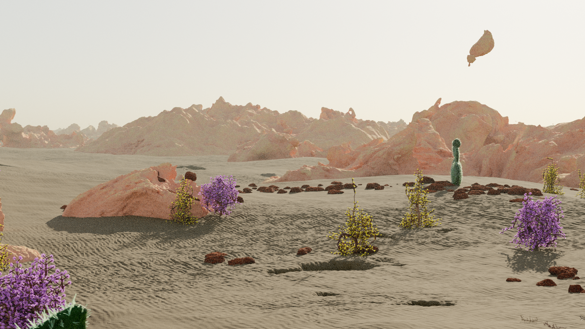
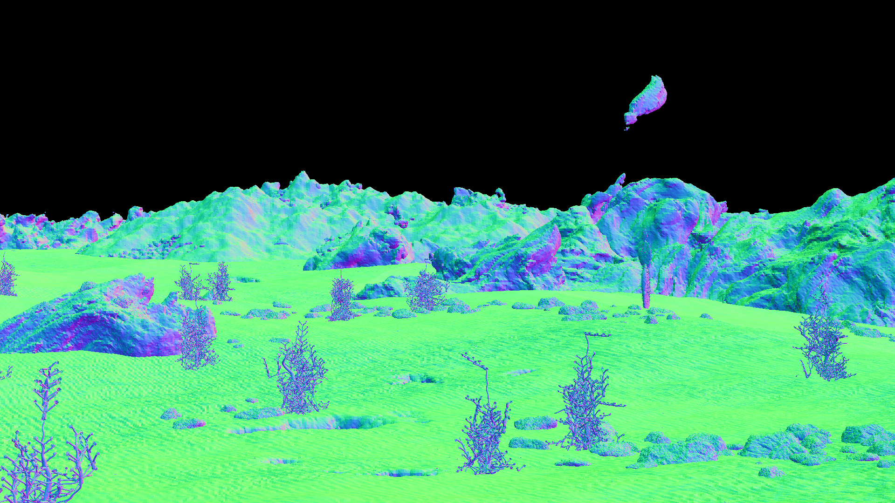

## [Infinigen: Infinite Photorealistic Worlds using Procedural Generation](https://infinigen.org)

Please visit our website, [https://infinigen.org](https://infinigen.org)

[](https://youtu.be/6tgspeI-GHY)

If you use Infinigen in your work, please cite our [academic paper]([https://arxiv.org/abs/2306.09310](https://arxiv.org/abs/2306.09310)):

<h3 align="center"><a href="https://arxiv.org/pdf/2306.09310">Infinite Photorealistic Worlds using Procedural Generation</a></h3>
<p align="center">
<a href="http://araistrick.com/">Alexander Raistrick</a>*, <a href="https://www.lahavlipson.com/">Lahav Lipson</a>*, <a href="https://mazeyu.github.io/">Zeyu Ma</a>* (*equal contribution, alphabetical order) <br>
<a href="https://www.cs.princeton.edu/~lm5483/">Lingjie Mei</a>, <a href="https://www.cs.princeton.edu/~mingzhew">Mingzhe Wang</a>, <a href="https://zuoym15.github.io/">Yiming Zuo</a>, <a href="https://kkayan.com/">Karhan Kayan</a>, <a href="https://hermera.github.io/">Hongyu Wen</a>, <a href="https://pvl.cs.princeton.edu/people.html">Beining Han</a>, <br>
<a href="https://pvl.cs.princeton.edu/people.html">Yihan Wang</a>, <a href="http://www-personal.umich.edu/~alnewell/index.html">Alejandro Newell</a>, <a href="https://heilaw.github.io/">Hei Law</a>, <a href="https://imankgoyal.github.io/">Ankit Goyal</a>, <a href="https://yangky11.github.io/">Kaiyu Yang</a>, <a href="http://www.cs.princeton.edu/~jiadeng">Jia Deng</a><br>
Conference on Computer Vision and Pattern Recognition (CVPR) 2023
</p>

```
@inproceedings{infinigen2023infinite,
  title={Infinite Photorealistic Worlds Using Procedural Generation},
  author={Raistrick, Alexander and Lipson, Lahav and Ma, Zeyu and Mei, Lingjie and Wang, Mingzhe and Zuo, Yiming and Kayan, Karhan and Wen, Hongyu and Han, Beining and Wang, Yihan and Newell, Alejandro and Law, Hei and Goyal, Ankit and Yang, Kaiyu and Deng, Jia},
  booktitle={Proceedings of the IEEE/CVF Conference on Computer Vision and Pattern Recognition},
  pages={12630--12641},
  year={2023}
}
```

### Getting Started

First, follow our [Installation Instructions](docs/Installation.md).

Next, see our ["Hello World" example](docs/HelloWorld.md) to generate an image & ground truth similar to those shown below.

<p align="center">
  
  
  
  
</p>

### Documentation

- [Installation Guide](docs/Installation.md)
- ["Hello World": Generate your first Infinigen scene](docs/HelloWorld.md)
- [Configuring Infinigen](docs/ConfiguringInfinigen.md)
- [Downloading pre-generated data](docs/PreGeneratedData.md)
- [Extended ground-truth](docs/GroundTruthAnnotations.md)
- [Generating individual assets](docs/GeneratingIndividualAssets.md)
- [Implementing new materials & assets](docs/ImplementingAssets.md)
- [Generating fluid simulations](docs/GeneratingFluidSimulations.md)

### Coming Soon
Please see our [project roadmap](https://infinigen.org/roadmap) and follow us at [https://twitter.com/PrincetonVL](https://twitter.com/PrincetonVL) for updates. 

### Contributing
We welcome contributions! You can contribute in many ways:
- **Contribute code to this repository** - We welcome code contributions. More guidelines coming soon.
- **Contribute procedural generators** - `infinigen/nodes/node_transpiler/dev_script.py` provides tools to convert artist-friendly [Blender Nodes](https://docs.blender.org/manual/en/2.79/render/blender_render/materials/nodes/introduction.html) into python code. Tutorials and guidelines coming soon.
- **Contribute pre-generated data** - Anyone can contribute their computing power to create data and share it with the community. Please stay tuned for a repository of pre-generated data.

### Getting Help

Please post this repository's Github Issues page for help. Please run your command with `--debug`, and let us know:
- What is your computing setup, including OS version, CPU, RAM, GPU(s) and any drivers?
- What version of the code are you using (link a commit hash), and what if any modifications have you made (new configs, code edits)
- What exact command did you run?
- What were the output logs of the command you ran? 
    - If using `manage_jobs`, look in `outputs/MYJOB/MYSEED/logs/` to find the right one.
    - What was the exact python error and stacktrace, if applicable?

### Acknowledgements

Infinigen wouldn't be possible without the fantastic work of the [Blender Foundation](https://www.blender.org/) and it's open-source contributors. Infinigen uses many open source projects, with special thanks to [Land-Lab](https://github.com/landlab/landlab), [BlenderProc](https://github.com/DLR-RM/BlenderProc) [Blender-FLIP-Fluids](https://github.com/rlguy/Blender-FLIP-Fluids) and [Blender-Differential-Growth](https://github.com/inca/blender-differential-growth).

We thank [Thomas Kole](https://blenderartists.org/u/ThomasKole) for providing procedural clouds and [Pedro P. Lopes](https://blendswap.com/blend/30728) for the autoexposure nodegraph. 

We learned tremendously from online tutorials of 
[Andrew Price](https://www.youtube.com/channel/UCOKHwx1VCdgnxwbjyb9Iu1g),
[Artisans of Vaul](https://www.youtube.com/@ArtisansofVaul),
[Bad Normals](https://www.youtube.com/@BadNormals),
[Blender Tutorial Channel](https://www.youtube.com/@BlenderTutorialChannel),
[blenderbitesize](https://www.youtube.com/@blenderbitesize),
[Blendini](http://www.youtube.com/watch?v=sHr8LjfX09c),
[Bradley Animation](https://www.youtube.com/@bradleyanimation120),
[CGCookie](https://www.youtube.com/watch?v=lPAYX8z9i8M),
[CGRogue](https://www.youtube.com/@PixelicaCG),
[Creative Shrimp](https://www.youtube.com/@CreativeShrimp),
[CrowdRender](https://www.youtube.com/@Crowdrender),
[Dr. Blender](https://www.youtube.com/@DrBlender),
[HEY Pictures](https://www.youtube.com/channel/UCo5rv1z-PPrCh-C7OvO2VAA),
[Ian Hubert](https://www.youtube.com/@IanHubert2),
[Kev Binge](https://www.youtube.com/@KevBinge),
[Lance Phan](https://www.youtube.com/@LancePhan),
[MaxEdge](https://www.youtube.com/@MaxEdge420),
[Mr. Cheebs](https://www.youtube.com/@MrCheebs),
[PixelicaCG](https://www.youtube.com/@PixelicaCG),
[Polyfjord](https://www.youtube.com/@Polyfjord),
[Robbie Tilton](https://www.youtube.com/@RobbieTilton),
[Ryan King Art](https://www.youtube.com/@RyanKingArt),
[Sam Bowman](https://www.youtube.com/@snow_mamba) and
[yogigraphics](https://www.youtube.com/@yojigraphics).
These tutorials provided procedural generators for our early experimentation and served as inspiration for our own implementations in the official release of Infinigen. They are acknowledged in file header comments where applicable. 

Infinigen has evolved significantly since the version described in our CVPR paper. It now features some procedural code obtained from the internet under CC-0 licenses, which are marked with code comments where applicable - no such code was present in the system for the CVPR version.
