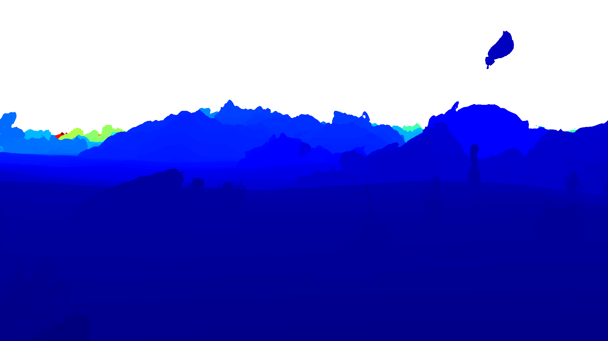

## [Infinigen: Infinite Photorealistic Worlds using Procedural Generation](https://infinigen.org)

Please visit our website, [https://infinigen.org](https://infinigen.org)

[](https://youtu.be/6tgspeI-GHY)

If you use Infinigen in your work, please cite our [academic paper](https://arxiv.org/abs/2306.09310):
```
@inproceedings{raistrick2023infinite,
  title={Infinite Photorealistic Worlds Using Procedural Generation},
  author={Raistrick, Alexander and Lipson, Lahav and Ma, Zeyu and Mei, Lingjie and Wang, Mingzhe and Zuo, Yiming and Kayan, Karhan and Wen, Hongyu and Han, Beining and Wang, Yihan and Newell, Alejandro and Law, Hei and Goyal, Ankit and Yang, Kaiyu and Deng, Jia},
  booktitle={Proceedings of the IEEE/CVF Conference on Computer Vision and Pattern Recognition},
  pages={12630--12641},
  year={2023}
}
```

## Installation

Installation is tested and working on the following platforms:

- Ubuntu 22.04.2 LTS 
    - GPUs options tested: CPU only, GTX-1080, RTX-2080, RTX-3090, RTX-4090 (Driver 525, CUDA 12.0)
    - RAM: 16GB
- MacOS Monterey & Ventura, Apple M1 Pro, 16GB RAM

We are working on support for rendering with AMD GPUs. Windows users should use [WSL2](https://ubuntu.com/tutorials/install-ubuntu-on-wsl2-on-windows-11-with-gui-support#1-overview). More instructions coming soon.

**Run these commands to get started**
```
git clone https://github.com/princeton-vl/infinigen.git
cd infinigen
conda create --name infinigen python=3.10
conda activate infinigen
bash install.sh
```
`install.sh` may take significant time to download Blender3.3 and compile all source files.

Ignore non-fatal warnings. See [Getting Help](#getting-help) for guidelines on posting github issues

Run the following or add it to your `~/.bashrc` (Linux/WSL) or `~/.bash_profile` (Mac)
```
# on Linux/WSL
export BLENDER="/PATH/TO/infinigen/blender/blender"
# on MAC
export BLENDER="/PATH/TO/infinigen/Blender.app/Contents/MacOS/Blender"
```

<details closed>
<summary><b>(Optional) OpenGL Ground Truth Installation</b></summary>

The above default install instructions enable you to run the full Infinigen scene generation system

This section will allow you to use our own `--pipeline_configs opengl_gt` ground truth extraction config, which avoids rendering twice in blender, and provides additional labels such occlusion boundaries, sub-object segmentation, 3D flow and easy 3D bounding boxes. If you do not need ground truth, or do not need these features,skip this section and use `--pipeline_configs blender_gt` as shown in [Generate image(s) in one command](#generate-images-in-one-command). This section is intended for computer vision researchers and power-users, and is currently *only supported on Ubuntu*. 

```
git submodule init
git submodule update
sudo apt-get install libglm-dev libglew-dev libglfw3-dev libgles2-mesa-dev zlib1g-dev
```

If you do not have sudo access, you may attempt the following:
- install them manually set your $CPATH variables appropriately. 
- ask your administrator to install them on your behalf

Finally, run
```
bash install.sh opengl
```
</details>

<details closed>
<summary><b>(Optional) Running Infinigen in a Docker Container</b></summary>

**Docker on Linux**

```
cd infinigen/docker
bash make_docker.sh
docker exec -it infinigen bash
source setup.sh
```

To disable GPU passthrough use `bash make_docker.sh --noGPU`

**Docker on Windows**
Install [WSL2](https://infinigen.org/docs/installation/intro#setup-for-windows) and [Docker Desktop](https://www.docker.com/products/docker-desktop/), with "Use the WSL 2 based engine..." enabled in settings. Keep the Docker Desktop application open while running containers. Then follow instructions as above.

</details>

### "Hello World": Generate your first Infinigen scene

 :warning: **Known issue** :warning: : We are actively fixing an issue which causes commands not to be reproducible on many platforms. The same command may produce multiple rearranged scenes with different runtimes and memory requirements.

<p align="center">
  
   
</p>

This guide will show you how to generate an image and it's corresponding depth ground-truth, similar to those shown above.

#### Generate a scene step by step
Infinigen generates scenes by running multiple tasks (usually executed automatically, like in [Generate image(s) in one command](#generate-images-in-one-command)). Here we will run them one by one to demonstrate. These commands take approximately 10 minutes and 16GB of memory to execute on an M1 Mac or Linux Desktop.

```
cd worldgen
mkdir outputs

# Generate a scene layout
$BLENDER -noaudio --background --python generate.py -- --seed 0 --task coarse -g desert simple --output_folder outputs/helloworld/coarse

# Populate unique assets
$BLENDER -noaudio --background --python generate.py -- --seed 0 --task populate fine_terrain -g desert simple --input_folder outputs/helloworld/coarse --output_folder outputs/helloworld/fine

# Render RGB images
$BLENDER -noaudio --background --python generate.py -- --seed 0 --task render -g desert simple --input_folder outputs/helloworld/fine --output_folder outputs/helloworld/frames

# Render again for accurate ground-truth
$BLENDER -noaudio --background --python generate.py -- --seed 0 --task render -g desert simple --input_folder outputs/helloworld/fine --output_folder outputs/helloworld/frames -p render.render_image_func=@flat/render_image 
```

Output logs should indicate what the code is working on. Use `--debug` for even more detail. After each command completes you can inspect it's `--output_folder` for results, including running `$BLENDER outputs/helloworld/coarse/scene.blend` or similar to view blender files. We hide many meshes by default for viewport stability; to view them, click "Render" or use the UI to unhide them.

#### Generate image(s) in one command

We provide `tools/manage_datagen_jobs.py`, a utility which runs these or similar steps automatically.

```
python -m tools.manage_datagen_jobs --output_folder outputs/hello_world --num_scenes 1 
--pipeline_configs local_16GB monocular blender_gt --specific_seed 0 --configs desert simple
```

Ready to remove the guardrails? Try the following:
- Swap `desert` for any of `config/scene_types` to get different biome (or write your own crazy config!). You can also add in the name of any file in `configs`.
- Change the `--specific_seed` to any number to produce different scenes, or remove it and set --num_scenes 50 to try many random seeds.
- Remove `simple` to generate more detailed (but *EXPENSIVE*) scenes, as shown in the trailer.
- Read and customize `generate.py` to understand how infinigen works under the hood. 
- Append `-p compose_scene.grass_chance=1.0` to the first command to force grass (or any of `generate.py's` 'run_stage' asset names) to appear in the scene. You can modify the kwargs @gin.configurable() python function in the entire repo via this mechanism. 

`--configs` enables you to customize the random *distribution* of visual content. If you do not select any config in the folder `config/scene_types`, the code choose one for you at random. 

`--pipeline_configs` determines what compute resources will be used, and what render jobs are necessary for each scene. A list of configs are available in `tools/pipeline_configs`. You must pick one config to determine compute type (ie `local_64GB` or `slurm`) and one to determine the dataset type (such as `monocular` or `monocular_video`). Run `python -m tools.manage_datagen_jobs --help` for more options related to dataset generation.

If you intend to use CUDA-accelerated terrain (`--pipeline_configs enable_gpu`), you must run `install.sh` on a CUDA-enabled machine. 

Infinigen uses [Google's "Gin Config"](https://github.com/google/gin-config) heavily, and we encourage you to consult their documentation to familiarize yourself with its capabilities.

## Exploring the Infinigen Codebase

Infinigen has evolved significantly since the version described in our CVPR paper. It now features some procedural code obtained from the internet under CC-0 licenses, which are marked with code comments where applicable - no such code was present in the system for the CVPR version.

Infinigen is an ongoing research project, and has some known issues. Through experimenting with Infinigen's code and config files, you will find scenes which crash or cannot be handled on your hardware. Infinigen scenes are randomized, with a long tail of possible scene complexity and thus compute requirements. If you encounter a scene that does not fit your computing hardware, you should try other seeds, use other config files, or follow up for help.

## Coming Soon

Infinigen will evolve rapidly over the coming months. Follow us at [https://twitter.com/PrincetonVL](https://twitter.com/PrincetonVL) for updates. 

### Tutorials & Documentation
We will add comprehensive tutorials and documentation for all aspects of Infinigen. This README is **preliminary**, and our docs will be expanded to cover all aspects of the project in detail. 

### Contributing
We welcome contributions! You can contribute in many ways:
- **Contribute code to this repository** - We welcome code contributions. More guidelines coming soon.
- **Contribute procedural generators** - `worldgen/nodes/node_transpiler/dev_script.py` provides tools to convert artist-friendly [Blender Nodes](https://docs.blender.org/manual/en/2.79/render/blender_render/materials/nodes/introduction.html) into python code. Tutorials and guidelines coming soon.
- **Contribute pre-generated data** - Anyone can contribute their computing power to create data and share it with the community. Please stay tuned for a repository of pre-generated data.

## Getting Help

Please post this repository's Github Issues page for help. Please run your command with `--debug`, and let us know:
- What is your computing setup, including OS version, CPU, RAM, GPU(s) and any drivers?
- What version of the code are you using (link a commit hash), and what if any modifications have you made (new configs, code edits)
- What exact command did you run?
- What were the output logs of the command you ran? 
    - If using `manage_datagen_jobs`, look in `outputs/MYJOB/MYSEED/logs/` to find the right one.
    - What was the exact python error and stacktrace, if applicable?


