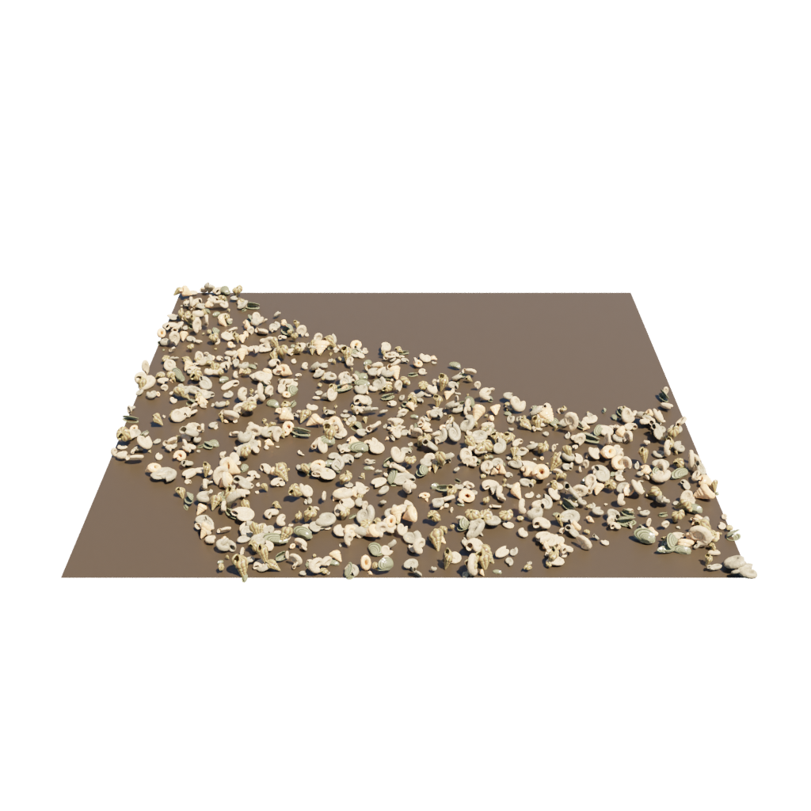
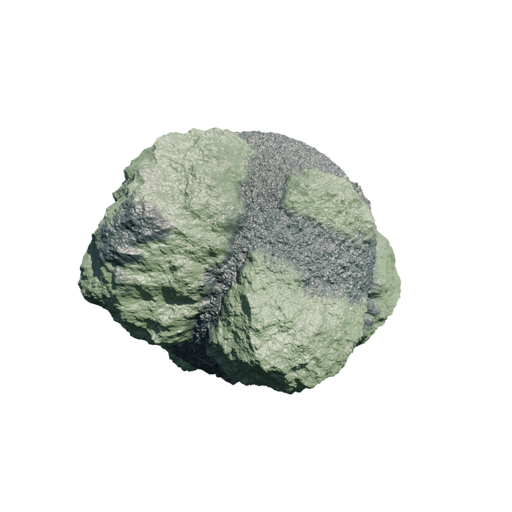

# Generating Individual Assets

This tutorial will help you generate images or .blend files of specific assets of your choice.

Limitations (to be addressed soon): 
- This tool only exports .blend files. [See here](../infinigen/datagen/tools/export/README.md) for a prototype tool to convert these to standard mesh file formats, but it itself has some limitations. 
- This tool cannot currently generate or export terrain meshes.

### Example Commands

Shown are three examples of using our `generate_individual_assets.py` script to create images and .blend files.

```bash
mkdir outputs
python -m infinigen_examples.generate_individual_assets -f CoralFactory -n 8 --save_blend
python -m infinigen_examples.generate_individual_assets -f seashells -n 1 --save_blend
python -m infinigen_examples.generate_individual_assets -f chunkyrock -n 1 --save_blend
```

<p align="center">
  
  
  
</p>

Running the above commands will save images and .blend files into your `outputs` folder.

Please run `python -m infinigen.tools.generate_individual_assets --help` for a full list of commandline arguments.

The most commonly used arguments are:
- `-f` to specify the name(s) of assets or materials to generate. `-f NAME` can specify to generate three different types of objects:
   - If `NAME` is the name of a class defined in `infinigen/assets`, then it will be treated as an AssetFactory and used to generate objects from scratch. For example, you can say `-f CactusFactory` or `-f CarnivoreFactory`, or use the name of any similar Factory class in the codebase.
   - If `NAME` is the name of a file in `infinigen/assets/materials`, that material will be applied onto a sphere
   - If `NAME` is the name of a file in `infinigen/assets/scatters`, that scatter generator will be applied nto a plane
- `-n` adjusts the number of images / blend files to be generated.


