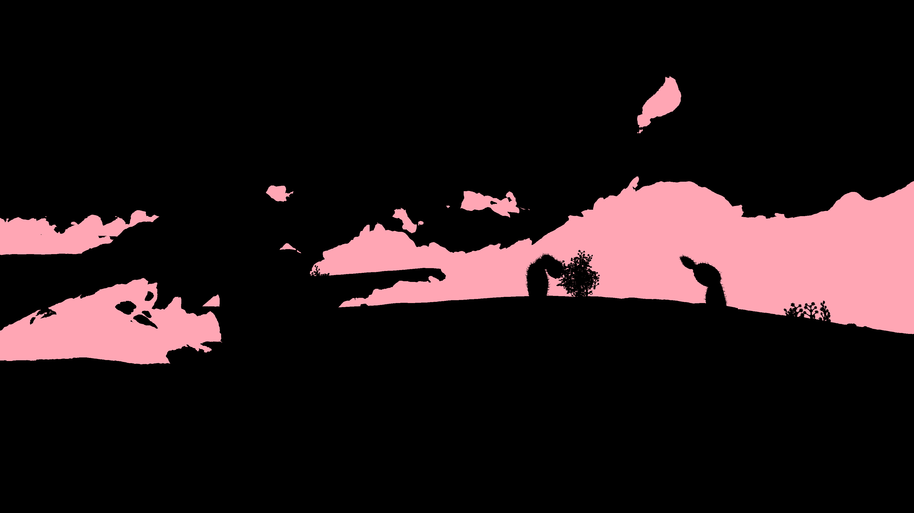

# Ground-Truth Annotations

### Agenda

- Save forward and backward flow for both built-in and advanced annotations.
- Compute flow occlusion using forward-backward consistency.
- Export scene geometry in .ply format.

**Want annotations that we don't currently support? [Fill out a request!](https://github.com/princeton-vl/infinigen/issues/new?assignees=&labels=&projects=&template=request.md&title=%5BREQUEST%5D)**

## Default Annotations from Blender

Infinigen can produce some dense annotations using Blender's built-in render passes. Users may prefer to use these annotations over our extended annotation system's since it requires only the bare-minimum installation. It is also able to run without a GPU.

These annotations are produced when using the `--pipeline_configs blender_gt` ground truth extraction config in [manage_jobs.py](/README.md#generate-images-in-one-command), or can be done manually as shown in the final step of the [Hello-World](/README.md#generate-a-scene-step-by-step) example.

## Advanced Annotation Pipeline :large_blue_diamond:

We also provide a separate pipeline for extracting the full set of annotations from each image or scene. Features only supported using this annotation method will be denoted with :large_blue_diamond:.

This will allow you to use our own `--pipeline_configs opengl_gt` ground truth extraction config, which provides additional labels such as occlusion boundaries, sub-object segmentation, 3D flow and easy 3D bounding boxes. If you do not need these features, we recommend using the [default annotations](#default-annotations-from-blender). This section is intended for computer vision researchers and power-users. 

### Installation

To ensure all submodule dependencies have been properly cloned, run:
```
git submodule init
git submodule update
```

On Ubuntu, run
```
sudo apt-get install libglm-dev libglew-dev libglfw3-dev libgles2-mesa-dev zlib1g-dev
```

If compiling on WSL, additionally run 
```
sudo apt-get install doxygen
sudo apt-get install libxinerama-dev
sudo apt-get install libxcursor-dev
sudo apt-get install libxi-dev
```

On MacOS, run
```
brew install glfw3
brew install glew
```

If you do not have sudo access, you may attempt the following:
- Install dependencies manually and set your $CPATH variables appropriately. 
- Ask your administrator to install them on your behalf (YMMV).

Finally, run the following:
```
bash scripts/install/compile_opengl.sh
```

### Extended Hello-World

To generate the hello-world scene using our custom annotation system, run:

```
python -m infinigen.datagen.manage_jobs --output_folder outputs/hello_world/0 --num_scenes 1 --specific_seed 0 \
--configs desert.gin simple.gin --pipeline_configs local_16GB.gin monocular.gin opengl_gt.gin --pipeline_overrides LocalScheduleHandler.use_gpu=False
```
This is the [the previous manage_datagen_jobs command](https://github.com/princeton-vl/infinigen_internal/blob/oc16_update_docs/docs/HelloWorld.md#generate-images-in-one-command), but replacing `blender_gt.gin` with `opengl_gt.gin`

## Specification

Below, we specify the data format and resolution of all ground truth passes exported by the default infinigen configuration. Where applicable, H and W refer to the height and width of the RGB image; some ground truth is stored at integer-multiples of this resolution, as described below. 

Note: In cases where both a .png and .npy file are available, we recommend you use the .png file only for visualization, and default to using the .npy file for training. 

**Depth**

Depth is stored as a 2H x 2W 32-bit floating point numpy array.

<p align="center">

</p>

The depth and camera parameters can be used to warp one image to another frame by running:
```
python -m infinigen.tools.ground_truth.rigid_warp <folder> <first-frame> <second-frame>
```

**Surface Normals**

Surface Normals are stored as a H x W x 3 32-bit floating point numpy array.

The coordinate system for the surface normals is +X -> Right, +Y -> Up, +Z Backward.

<p align="center">

</p>

### Occlusion Boundaries :large_blue_diamond:

Occlusion Boundaries are  a >= 2H x 2W png, with 255 indicating a boundary and 0 otherwise.

<p align="center">

</p>

### Optical Flow

Optical Flow / Scene Flow is  a H x W x 3 32-bit floating point numpy array.

*Note: The values won't be meaningful if this is the final frame in a series, or in the single-view setting.*

Channels 1 & 2 are standard optical flow. Note that the units of optical flow are in pixels measured in the resolution of the *original image*. So if the rendered image is 1080 x 1920, you would want to average-pool this array by 2x.

**3D Motion Vectors** :large_blue_diamond:

Channel 3 is the depth change between this frame and the next.

To see an example of how optical flow can be used to warp one frame to the next, run

```
python -m infinigen.tools.ground_truth.optical_flow_warp <folder> <frame-number>
```

If using `blender_gt.gin` rathern than `opengl_gt.gin` replace `Flow3D` with `Flow`, since Blender does not export 3D flow.

### Optical Flow Occlusion :large_blue_diamond:

The mask of occluded pixels for the aforementioned optical flow is stored as a H x W png, with 255 indicating a co-visible pixel and 0 otherwise.

*Note: This mask is computed by comparing the face-ids on the triangle meshes at either end of each flow vector. Infinigen meshes often contain multiple faces per-pixel, resulting in frequent false-negatives (negative=occluded). These false-negatives are generally distributed uniformly over the image (like salt-and-pepper noise), and can be reduced by max-pooling the occlusion mask down to the image resolution.*

### Camera Intrinsics & Extrinsics

Camera intrinsics and extrinsics are stored as a numpy ".npz" file inside the "camview" folder.

Infinigen renders images using a pinhole camera model. The resulting camera intrinsics for each frame are stored as a 3 x 3 numpy matrix.

The camera pose is stored as a 4 x 4 numpy matrix mapping from camera coordinates to world coordinates.

As is standard in computer vision, the assumed world coordinate system in the saved camera poses is +X -> Right, +Y -> Down, +Z Forward. This is opposed to how Blender internally represents geometry, with flipped Y and Z axes.

### Panoptic Segmentation

Infinigen saves three types of semantic segmentation masks: 1) Object Segmentation 2) Tag Segmentation 3) Instance Segmentation

*Object Segmentation* distinguishes individual blender objects, and is stored as a H x W 32-bit integer numpy array. Each integer in the mask maps to an object in Objects_XXXX_XX_XX.json with the same value for the `"object_index"` field. The definition of "object" is imposed by Blender; generally large or complex assets such as the terrain, trees, or animals are considered one singular object, while a large number of smaller assets (e.g. grass, coral) may be grouped together if they are using instanced-geometry for their implementation.

*Instance Segmentation* distinguishes individual instances of a single object from one another (e.g. separate blades of grass, separate ferns, etc.), and is stored as a H x W x 3 32-bit integer numpy array. Each integer in this mask is the *instance-id* for a particular instance, which is unique for that object as defined in the Object Segmentation mask and Objects_XXXX_XX_XX.json.

Generally, most useful panoptic segmentation masks can be constructed by combining the aforementioned two arrays in some way. As an example, to visualize the 2D and [3D bounding boxes](#object-metadata-and-3d-bounding-boxes) for rock objects in the hello world scene, run 
```
python -m tools.ground_truth.segmentation_lookup outputs/hello_world/0 48 --query rock --boxes
python -m tools.ground_truth.bounding_boxes_3d outputs/hello_world/0 48 --query rock
```
By ommitting the --query flag, a list of available tags will be printed.

#### **Tag Segmentation** :large_blue_diamond:

*Tag Segmentation* distinguishes vertices based on their semantic tags, and is stored as a H x W 64-bit integer numpy array. Infinigen tags all vertices with an integer which can be associated to a list of semantic labels in `MaskTag.json`. Compared to Object Segmentation, Infinigen's tagging system is less automatic but much more flexible. Requested features in the tagging system are usually possible and straightforward to implement, wheras in the automaically generated Object Segmentation they are not. 

A benefit of our tagging system is that one can produce a segmentation mask for things which are not a distinct object, such as terrain attributes. For instance, we can highlight only *caves* or *warped rocks*

<p align="center">
 
</p>

### Object Metadata and 3D bounding boxes

Each item in `Objects_0001_00_00.json` also contains other metadata about each object:
```
# Load object meta data
object_data = json.loads(Path("outputs/helloworld/frames/Objects/camera_0/Objects_0_0_0001_0.json").read_text())

# select nth object
obj = object_data[n]

obj["children"] # list of object indices for children
obj["object_index"] # object index, for lookup in the Object Segmentation mask
obj["num_verts"] # number of vertices
obj["num_faces"] # number of faces (n-gons, not triangles)
obj["name"] # obvious
obj["unapplied_modifiers"] # names of unapplied blender modifiers
obj["materials"] # materials used
```

More fields :large_blue_diamond:
```
obj["tags"] # list of tags which appear on at least one vertex 
obj["min"] # min-corner of bounding box, in object coordinates
obj["max"] # max-corner of bounding box, in object coordinates
obj["model_matrices"] # 4x4 obj->world transformation matrices for all instances
```

The **3D bounding box** for each instance can be computed using `obj["min"]`, `obj["max"]`, `obj["model_matrices"]`. For an example, refer to [the bounding_boxes_3d.py example above](#panoptic-segmentation).
