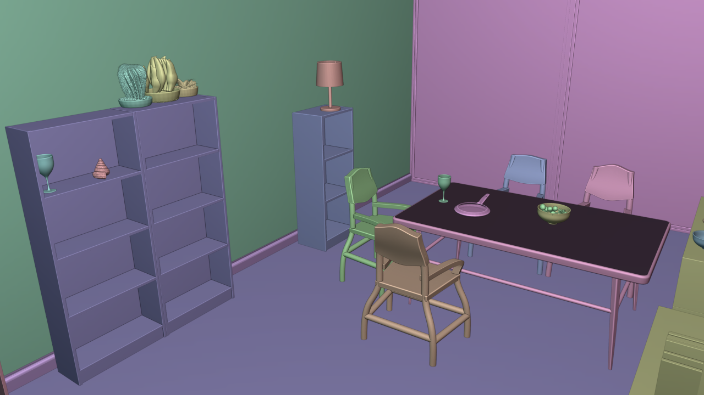
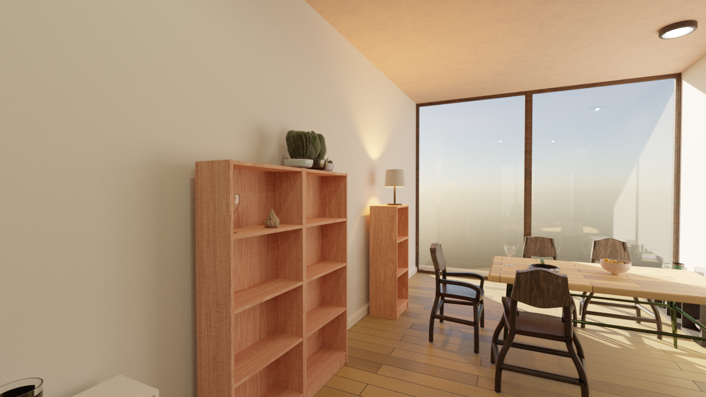
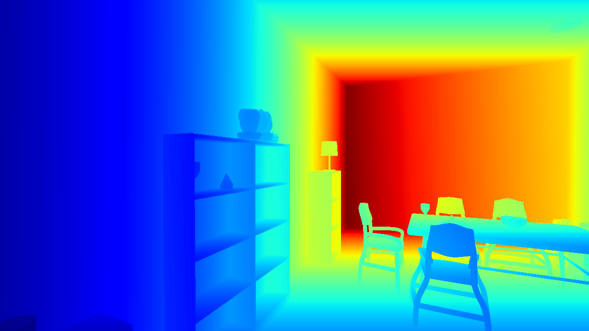
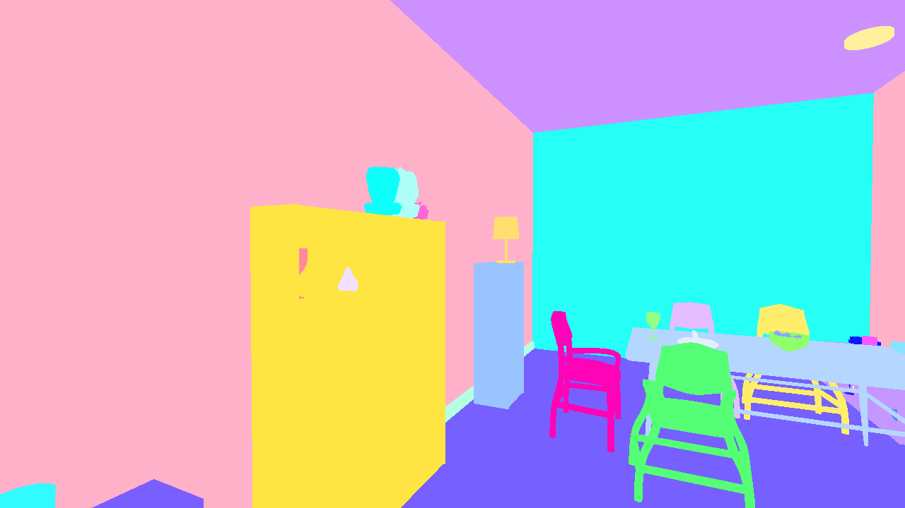

# Hello Room: Generate your first Infinigen-Indoors scene

<p align="center">
  
  
  
  
</p>

## Generate a scene step-by-step

Infinigen has distinct scene generation & rendering stages. We typically run these automatically for you (skip to [Generate scenes automatically](#generating-scenes-automatically)

#### Generate a blender file

First, run ONE command of your choosing from the block below. This will generate a 3D blender file for use in the subsequent steps.

NOTE: `fast_solve.gin` runs the system for fewer solving steps, which sacrifices quality for speed. Remove t
his to get a more complex & realistic arrangement. You can also remove `compose_indoors.terrain_enabled=False` to add a realistic terrain background (provided you [installed terrain](./Installation.md))

```bash
# Diningroom, single room only, first person view (~8min CPU runtime)
python -m infinigen_examples.generate_indoors --seed 0 --task coarse --output_folder outputs/indoors/coarse -g fast_solve.gin singleroom.gin -p compose_indoors.terrain_enabled=False restrict_solving.restrict_parent_rooms=\[\"DiningRoom\"\]

# Bathroom, single room only, first person view (~13min CPU runtime)
python -m infinigen_examples.generate_indoors --seed 0 --task coarse --output_folder outputs/indoors/coarse -g fast_solve.gin singleroom.gin -p compose_indoors.terrain_enabled=False restrict_solving.restrict_parent_rooms=\[\"Bathroom\"\]

# Bedroom, single room only, first person view (~10min CPU runtime)
python -m infinigen_examples.generate_indoors --seed 0 --task coarse --output_folder outputs/indoors/coarse -g fast_solve.gin singleroom.gin -p compose_indoors.terrain_enabled=False restrict_solving.restrict_parent_rooms=\[\"Bedroom\"\]

# Kitchen, single room only, first person view (~10min runtime, CPU only)
python -m infinigen_examples.generate_indoors --seed 0 --task coarse --output_folder outputs/indoors/coarse -g fast_solve.gin singleroom.gin -p compose_indoors.terrain_enabled=False restrict_solving.restrict_parent_rooms=\[\"Kitchen\"\]

# LivingRoom, single room only, first person view (~11min runtime, CPU only)
python -m infinigen_examples.generate_indoors --seed 0 --task coarse --output_folder outputs/indoors/coarse -g fast_solve.gin singleroom.gin -p compose_indoors.terrain_enabled=False restrict_solving.restrict_parent_rooms=\[\"LivingRoom\"\]

# Floor layout, overhead view, no objects (~34 second runtime, CPU only):
python -m infinigen_examples.generate_indoors --seed 0 --task coarse --output_folder outputs/indoors/coarse -g no_objects.gin overhead.gin -p compose_indoors.terrain_enabled=False

# Single random room with objects, overhead view (~11min. runtime CPU only):
python -m infinigen_examples.generate_indoors --seed 0 --task coarse --output_folder outputs/indoors/coarse -g fast_solve.gin overhead.gin singleroom.gin -p compose_indoors.terrain_enabled=False compose_indoors.overhead_cam_enabled=True restrict_solving.solve_max_rooms=1 compose_indoors.invisible_room_ceilings_enabled=True compose_indoors.restrict_single_supported_roomtype=True

# Whole apartment with objects, overhead view:
python -m infinigen_examples.generate_indoors --seed 0 --task coarse --output_folder outputs/indoors/coarse -g fast_solve.gin overhead.gin studio.gin -p compose_indoors.terrain_enabled=False
```

Once complete, you can inspect / fly around `outputs/indoors/coarse/scene.blend` in the blender UI:

```bash 
python -m infinigen.launch_blender outputs/indoors/coarse/scene.blend
```

You may be prompted to revisit our [Installation.md](./Installation.md#installing-infinigen-as-a-blender-python-script) if blender is not yet installed.

#### Render image and ground truth

Next, run the commands below to render an RGB image and ground truth:

```bash
# Render RGB images
python -m infinigen_examples.generate_nature --seed 0 --task render --input_folder outputs/indoors/coarse --output_folder outputs/indoors/frames

# Use blender to extract ground-truth (optional)
python -m infinigen_examples.generate_nature --seed 0 --task render --input_folder outputs/indoors/coarse --output_folder outputs/indoors/frames -p render.render_image_func=@flat/render_image 
```

Once complete, you can open `outputs/indoors/frames` and navigate to view the results.

#### Next Steps

See [ExportingToExternalFileFormats](./ExportingToExternalFileFormats.md) and [ExportingToSimulators](./ExportingToSimulators.md) to export to OBJ/USD.

We also provide an OpenGL-based ground truth extractor which offers additional ground truth channels, read more about using our ground truth [here](GroundTruthAnnotations.md).

## Generating scenes automatically

To generate a single scene in one command, you can run the following:
```bash
python -m infinigen.datagen.manage_jobs --output_folder outputs/my_dataset --num_scenes 1 --pipeline_configs local_256GB.gin monocular.gin blender_gt.gin indoor_background_configs.gin --configs singleroom.gin --pipeline_overrides get_cmd.driver_script='infinigen_examples.generate_indoors' manage_datagen_jobs.num_concurrent=16 --overrides compose_indoors.restrict_single_supported_roomtype=True 
```

To create a large dataset of many random rooms, we recommend:
```bash
python -m infinigen.datagen.manage_jobs --output_folder outputs/my_dataset --num_scenes 1000 --pipeline_configs local_256GB.gin monocular.gin blender_gt.gin indoor_background_configs.gin --configs singleroom.gin --pipeline_overrides get_cmd.driver_script='infinigen_examples.generate_indoors' manage_datagen_jobs.num_concurrent=16 --overrides compose_indoors.restrict_single_supported_roomtype=True 
```

You can inspect `outputs/my_dataset/SEED/` to see the running logs of the subprocesses and output results.

See [ConfiguringInfinigen.md](./ConfiguringInfinigen.md) for documentation on `manage_jobs` and commandline options.

## Developer Guide

More documentation coming soon.

### Restricting the solver to certain rooms / objects

Configuring `compose_indoors()` and ``restrict_solving()` via gin allows you to only solve sub-parts of the default constraint problem:

```
python -m infinigen_examples.generate_indoors --seed 0 --task coarse --output_folder outputs/indoors/coarse -g fast_solve -p \
    compose_indoors.terrain_enabled=False compose_indoors.solve_medium_enabled=False \
    restrict_solving.restrict_parent_rooms=[\"Kitchen\"] \
    restrict_solving.restrict_child_primary=[\"KitchenCounter\"] \
    restrict_solving.restrict_child_secondary=[\"Sink\"] \
    restrict_solving.solve_max_rooms=1 \
    restrict_solving.consgraph_filters=[\"counter\",\"sink\"] \
    compose_indoors.solve_steps_large=30 compose_indoors.solve_steps_small=30
```

Each of these commandline args demonstrates a different way in which you can restrict what work the system does:
- `compose_indoors.terrain_enabled=False compose_indoors.solve_medium_enabled=False` turns off medium objects (paintings/chairs/ceilinglights) and also terrain. You can use this same pattern to disable any `p.run_stage(name, func, ...)` statement found in generate_indoors by specifying f`compose_indoors.{name}_enabled=False`
- `restrict_solving.solve_max_rooms=1` specifies to only solve objects in 1 room of the house
- `restrict_solving.restrict_parent_rooms=[\"Kitchen\"]` specifies to only solve objects in kitchen rooms. You can see `infinigen/core/tags.py` for available options.
- `restrict_solving.restrict_child_primary=[\"KitchenCounter\"]` specifies that when placing objects directly onto the room, we will only consider placing *KitchenCounter* objects, not other types of objects. You can see `infinigen/core/tags.py` for available options.
- `restrict_solving.restrict_child_secondary=[\"Sink\"]` specifies that when placing objects onto other objects, we will only consider placing *Sink* objects, not other types of objects. You can see `infinigen/core/tags.py` for available options.
- `restrict_solving.consgraph_filters=[\"counter\",\"sink\"]` says to throw out any `constraints` or `score_terms` keys from `home_furniture_constraints()` that do not contain `counter` or `sink` as substrings, producing a simpler constraint graph. 
- `compose_indoors.solve_steps_large=30 compose_indoors.solve_steps_small=30` says to spend fewer optimization steps on large/small objects. You can also do the same for medium. These values override the defaults provided in `fast_solve.gin` and `infinigen_examples/configs_indoor/base.gin`

These settings are intended for debugging or for generating tailored datasets. If you want more granular control over what assets are used for what purposes, please customize `infinigen_examples/indoor_asset_semantics.py` which defines this mapping. 

If you are using the commands from [Creating large datasets](#creating-large-datasets) you will instead add these configs as `--overrides` to the end of your command, rather than `-p`

### Generate Rooms with Floating Objects

To enable floating objects in a room, add the override `compose_indoors.floating_objs_enabled=True`. For example:
```
python -m infinigen_examples.generate_indoors --seed 0 --task coarse --output_folder outputs/indoors/coarse -g fast_solve.gin singleroom.gin -p compose_indoors.floating_objs_enabled=True compose_indoors.terrain_enabled=False restrict_solving.restrict_parent_rooms=\[\"DiningRoom\"\]

```
By default, between 15 and 25 objects are generated and have their size normalized to fit within a 0.5m cube. The number of objects can be configured with `compose_indoors.num_floating` and normalization can be disabled with `compose_indoors.norm_floating=False`. Collisions/intersections between floating objects and existing solved objects are off by default and can be enabled with `compose_indoors.enable_collision_floating=True` and `compose_indoors.enable_collision_solved=True`.

## Run unit tests
```
pytest tests/ --disable-warnings
```