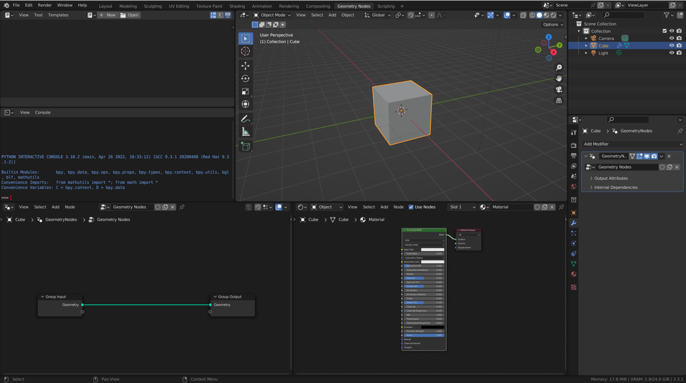
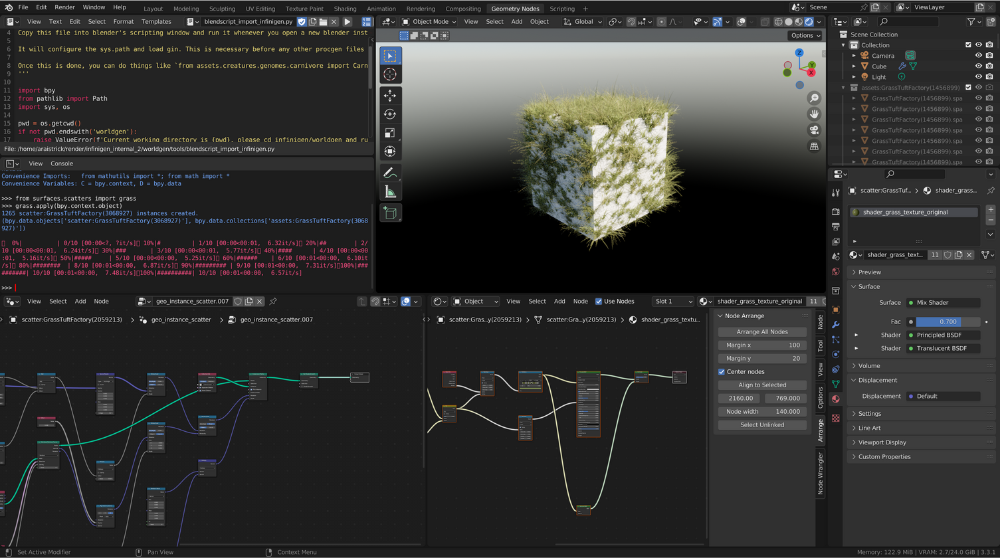
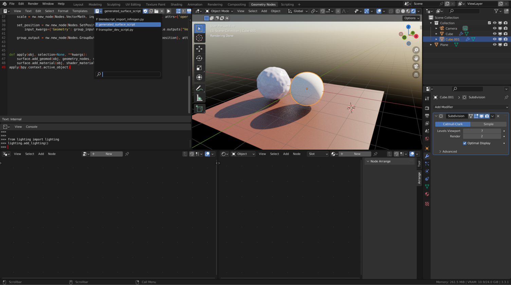

# Implementing new materials & assets

This guide will get you started on making your own procedural assets. If not already done, you must complete the "Infinigen as a Blender-Python script" section of the [Installation Instructions](./Installation.md) to download a standalone copy of Blender.

The workflow described in this guide requires some knowledge of python *and* the Blender UI. 
- If you are familiar with Blender but not Python:
   - You may have success trying out this guide anyway. You can work on your asset entirely in geometry/shaders nodes, and click one button to save them as a python file which can be run without edits by you to reproduce your asset and nodegroups.
   - If you would rather not interact with code at all, please follow us for updates on an artist-friendly, zero-programming-required asset contribution system. 
- If you are only familiar with Python but not Blender:
   - You may have success trying out this guide anyway. If you can navigate the Blender UI (either by trial and error, or via the many great [online resources](https://www.youtube.com/watch?v=nIoXOplUvAw&t=34s)), this tutorial will help you use Blender as a powerful visual debugging tool to repeatedly test code you write in your usual IDE. 
   - Ultimately you can work on Infinigen by only manipulating code/text files. The best approach to get started on this at present is to read the many existing python files in the repo. We will work on better documentation and APIs for python developers. 

This guide does not cover how to add new elements to the terrain marching cubes mesh. This guide also does not cover adding different lighting, although you can use a similar node-based workflow to modify [the already existing lighting assets](infinigen/assets/lighting) in the repo.

## Setting up the Blender UI for interactive development

Unless you intend to work solely on python/other code (and don't intend to interact much with Blender APIs) it will help you to have easy access to Infinigen via the Blender UI.

To open the Blender UI, run the following in a terminal:
```bash
python -m infinigen.launch_blender dev_scene.blend
```

We recommend you set your Blender UI up so you can see a Text Editor, Python Console, 3D Viewport, Geometry Nodes and a Shader Nodes window. The easiest way to do this is to complete the following steps (UI locations also marked in red in the screenshot below):
1. Click the "Geometry Nodes" tab
1. Use the dropdown in the top left of the spreadsheet window (marked in #1 red) to change it to a Text Editor.
1. Drag up from the bottom right of the window (marked in #2 red) to split it in half vertically. Convert this new window to a Python console using the dropdown in its top-left corner, similarly to step 2.
1. Click the New button (marked #4 in red) to add a geometry node group to the cube
1. Drag left from the bottom right corner of the geometry nodes window (similarly as in step 3) to split the window in half, and use the dropdown in the top left of the new window to convert it into a Shader Editor.   


Once these steps are complete, you should see something similar to the following:



You do not have to use this UI configuration all the time, but the following steps assume you know how to access these windows when needed. 

## Generating assets/materials via Blender Python Commandline

Now that you have imported Infinigen into Blender, you can easily access all its assets and materials via the commandline.

To start, we recommend using Infinigen's sky lighting while you make your asset, so you can get a better sense of what the asset will look like in full scenes. To sample a random sky lighting, run the following two steps in your Blender console:
```python
from infingen.assets.lighting import sky_lighting
sky_lighting.add_lighting()
```

You can use this mechanism to access any asset or python file under the `infinigen/` folder. For example run `from infinigen.assets.scatters import grass` then `grass.apply(bpy.context.active_object)` in the Python Console window to apply our grassland scatter generator directly onto whichever object is selected & highlighted orange in your UI. The first statement imports the python script shown in `infinigen/assets/scatters/grass.py`. You can use a similar statement to test out any python file under the infinigen/ folder, by replacing `surfaces.scatters` and `grass` with the relevant subfolder names and python filename.



The Geometry Node and Shader Node windows in this screenshot show nodegraphs generated automatically by Infinigen. By default, automatically generated nodegraphs will not be neatly organized. If you want to manually inspect them in the UI, we recommend installing the Node Arrange addon (via Edit>Preferences>Addons then Search). Once installed, use it by selecting any node, and clicking the `Arrange` button shown in the right sidebar, to achieve nicely arranged nodegraphs as shown in the screenshot.

:warning: If you edit your python code after importing it into Blender, your changes will not be used unless you manually force blender to reload the python module. Importing it a second time is not sufficient, you must either restart blender or use `importlib.reload`.

## Implementing a new material or surface scatter

To add a material to Infinigen, we must create a python file similar to those in `infinigen/assets/materials`. You are free to write such a file by hand in python using our `NodeWrangler` utility, but we recommend instead implementing your material in Blender then using our Node Transpiler to convert it to python code. 

To start, use the Blender UI to implement a material of your choice. Below, we show a simple snowy material comprised of a geometry nodegroup and a shader nodegroup applied to a highly subdivided cube. Please see the many excellent blender resources acknowledged in our README for help learning to use Blender's geometry and shader nodes.


### Using the Node Transpiler

Click the folder icon in the Text Editor window, and navigate to and open `nodes/transpiler/transpiler_dev_script.py`. You should see a new script appear. Now, make sure the target object containing your material or other asset nodegraphs is selected, then click the play button in the Text Editor window to run the transpiler. It should complete in less than one second, and will result in a new script being added to the Text Editor script-selection dropdown named `generated_surface_script.py`. Here is the resultant script for the snow example material:

```python
import bpy
import bpy
import mathutils
from numpy.random import uniform, normal, randint
from infinigen.core.nodes.node_wrangler import Nodes, NodeWrangler
from infinigen.core.nodes import node_utils
from infinigen.core.util.color import color_category
from infinigen.core import surface

def shader_material(nw: NodeWrangler):
    # Code generated using version 2.6.4 of the node_transpiler

    principled_bsdf = nw.new_node(Nodes.PrincipledBSDF,
        input_kwargs={'Base Color': (0.5004, 0.5149, 0.6913, 1.0000), 'Subsurface Radius': (0.0500, 0.1000, 0.1000), 'Roughness': 0.1182})
    
    material_output = nw.new_node(Nodes.MaterialOutput, input_kwargs={'Surface': principled_bsdf}, attrs={'is_active_output': True})

def geometry_nodes(nw: NodeWrangler):
    # Code generated using version 2.6.4 of the node_transpiler

    group_input = nw.new_node(Nodes.GroupInput, expose_input=[('NodeSocketGeometry', 'Geometry', None)])
    
    normal = nw.new_node(Nodes.InputNormal)
    
    noise_texture = nw.new_node(Nodes.NoiseTexture, input_kwargs={'Scale': 2.6600, 'Detail': 0.8000, 'Roughness': 1.0000})
    
    multiply = nw.new_node(Nodes.Math, input_kwargs={0: noise_texture.outputs["Fac"], 1: 0.1300}, attrs={'operation': 'MULTIPLY'})
    
    noise_texture_1 = nw.new_node(Nodes.NoiseTexture, input_kwargs={'Scale': 100.0000, 'Detail': 15.0000, 'Roughness': 1.0000})
    
    multiply_1 = nw.new_node(Nodes.Math, input_kwargs={0: noise_texture_1.outputs["Fac"], 1: 0.0150}, attrs={'operation': 'MULTIPLY'})
    
    add = nw.new_node(Nodes.Math, input_kwargs={0: multiply, 1: multiply_1})
    
    scale = nw.new_node(Nodes.VectorMath, input_kwargs={0: normal, 'Scale': add}, attrs={'operation': 'SCALE'})
    
    set_position = nw.new_node(Nodes.SetPosition,
        input_kwargs={'Geometry': group_input.outputs["Geometry"], 'Offset': scale.outputs["Vector"]})
    
    group_output = nw.new_node(Nodes.GroupOutput, input_kwargs={'Geometry': set_position}, attrs={'is_active_output': True})

def apply(obj, selection=None, **kwargs):
    surface.add_geomod(obj, geometry_nodes, selection=selection, attributes=[])
    surface.add_material(obj, shader_material, selection=selection)
apply(bpy.context.active_object)
```

The last line of this script calls `apply` on the currently selected object in the Blender UI. This means that you can test your script by creating and selecting a new object (ideally with a high resolution Subdivision Surface modifier) as shown:



You can then click play on the `generated_surface_script` to run it, and it should reconstruct similar nodegraphs on this new object. To include your new material in the infinigen repository, edit the `transpiler_dev_script` to say `mode=write_file`, then run it again. This will dump a new file named `generated_surface_script.py` which you can then move to `infinigen/assets/materials/mymaterial.py`. You can now import and test your material script via the commandline [as described earlier](#generating_assets_materials_via_blender_python_commandline)

## Implementing a new 3D asset

All asset generators in Infinigen are defined by python files in `infinigen/assets`, usually following this template:

```python
import bpy
import numpy as np

from infinigen.core.placement.factory import AssetFactory
from infinigen.core.util.math import FixedSeed

class MyAssetFactory(AssetFactory):

    def __init__(self, factory_seed):
        super().__init__(factory_seed)
        with FixedSeed(factory_seed):
            self.my_randomizable_parameter = np.random.uniform(0, 100)

    def create_asset(self, **kwargs) -> bpy.types.Object:
        return None # define and return a blender object using the `bpy` api
```

You can implement the `create_asset` function however you wish so long as it produces a Blender Object as a result. Many existing assets use various different strategies, which you can use as examples:
- `assets/flower.py` uses mostly auto-generated code from transpiling a hand-designed geometry node-graph.
- `assets/grassland/grass_tuft.py` uses pure NumPy code to create and define a mesh.
- `assets/trees/infinigen_examples/generate_nature.py` combines transpiled materials & leaves with a python-only space colonization algorithm.

The simplest implementation for a new asset is to create a geometry nodes equivelant, transpile it similarly to as shown above, copy the code into the same file as the template shown above, and implement the `create_asset` function as shown:

```python
from infinigen.core.util import blender as butil

...

def apply(obj):
    # code from the transpiler

...
class MyAssetFactory(AssetFactory):
    ...
    def create_asset(self, **kwargs):
        obj = butil.spawn_vert() # dummy empty object to apply on
        apply(obj)
        return obj
```

If you place the above text in a file located at `infinigen/assets/myasset.py`, you can add the following script to your Blender TextEditor and click play to repeatedly reload and test your asset generator as you continue to refine it.

```python
import bpy
import importlib

from infinigen.assets import myasset
importlib.reload(myasset) 

seed = 0
obj = myasset.MyAssetFactory(seed).spawn_asset(0)
```
