# Static Assets: Import External Assets to Infinigen Indoors

In this guide, we will show you how to import external (static) assets into Infinigen. This is useful if you want to create scenes with categories of assets that are not covered by Infinigen (say sculptures, etc), or if you just want to add more variety to your scenes with custom assets. 

:warning: This guide is not the only way to add assets to an Infinigen scene. Infinigen works with Blender scenes, so you can always use Blender's [import ops](https://docs.blender.org/api/current/bpy.ops.import_scene.html) to add objects. The instructions below go beyond this by showing how to integrate with the placement system, IE how to make the assets appear at sensible random locations.

## Download the Objects

We will get started by downloading the objects we want to import. For this example, we will use a shelf, a leather sofa, and a table from [Objaverse](https://objaverse.allenai.org/). You can use any objects you like, as long as it is one of the following formats:
- .dae
- .abc
- .usd
- .obj
- .ply
- .stl
- .fbx
- .glb
- .gltf
- .blend

I would recommend using .glb or .gltf files since they are the most extensively tested.

1. Download the following assets in .glb format from Sketchfab: 

    - [Iron Shelf](https://sketchfab.com/3d-models/iron-shelf-fd0cd420ffe04ac08174926f6b175d3f) (Attributed to Thunder and is licensed under [CC BY-SA 4.0](https://creativecommons.org/licenses/by-sa/4.0/). We use this asset with modification, i.e. rendered image). 

    - [Office Couch](https://sketchfab.com/3d-models/office-couch-ca63db1db205476fa6f54e1603b7d15d) (Attributed to Virenimation and is licensed under [CC BY 4.0](https://creativecommons.org/licenses/by/4.0/). We use this asset with modification, i.e. rendered image). 

    - [Table](https://sketchfab.com/3d-models/de-table-63e4d8faac73435fa7e9e929baa2c175) (Attributed to DeCloud and is licensed under [CC BY 4.0](https://creativecommons.org/licenses/by/4.0/). We use this asset with modification, i.e. rendered image). 

<p align="center">
  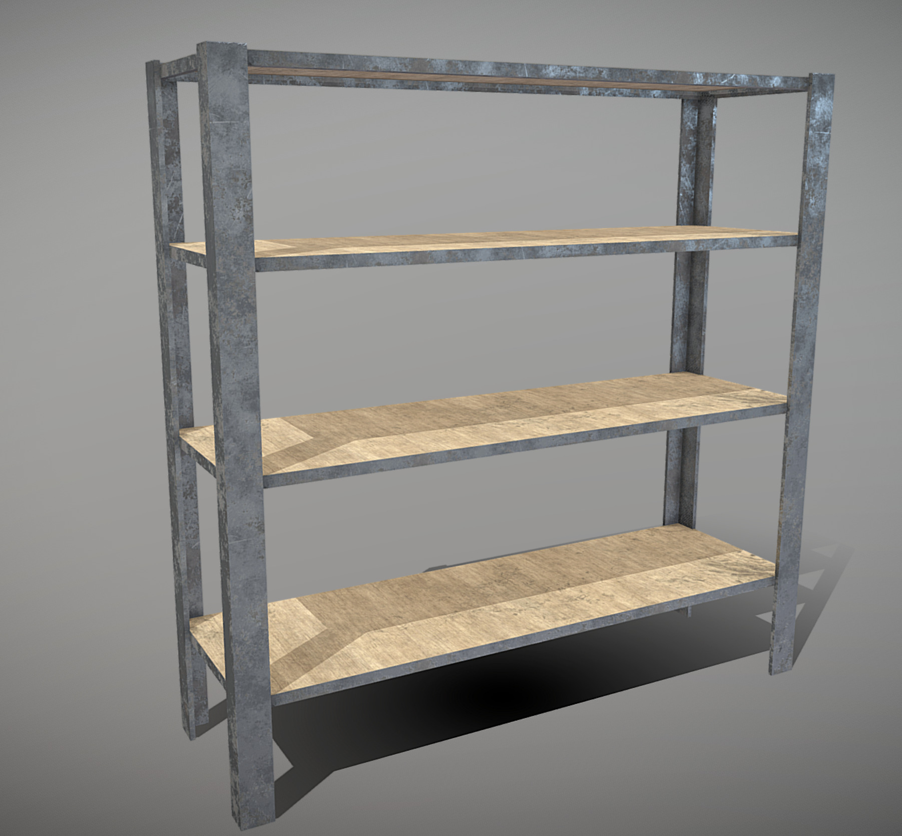
  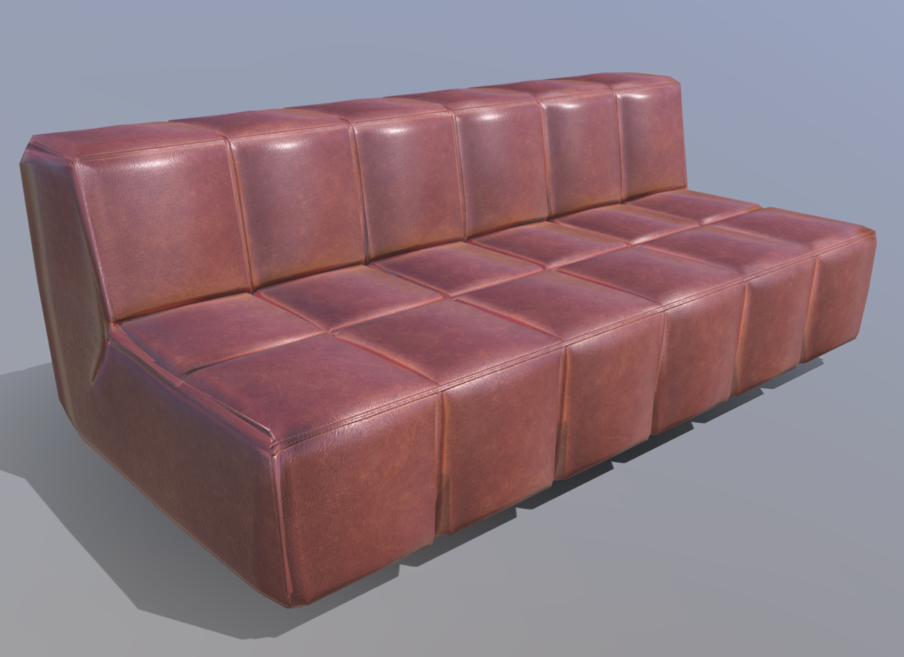
  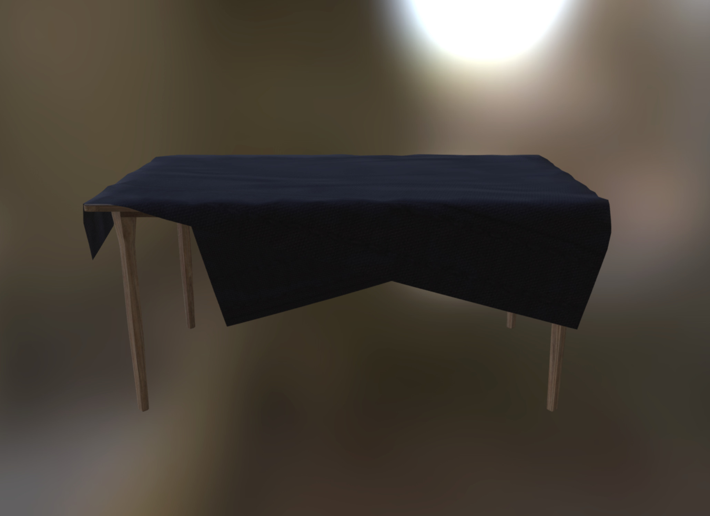
</p>

2. Create a folder for each category you want to import in `infinigen/assets/static_assets/source`. That is, create the folders `infinigen/assets/static_assets/Shelf`, `infinigen/assets/static_assets/Sofa`, and `infinigen/assets/static_assets/Table`.

```bash
mkdir infinigen/assets/static_assets/source
mkdir infinigen/assets/static_assets/source/Shelf
mkdir infinigen/assets/static_assets/source/Sofa
mkdir infinigen/assets/static_assets/source/Table
```

3. Place the downloaded .glb files in the corresponding folders. For this example, you should have three folders with one .glb file each.

Now, whenever we tell Infinigen to import a static Shelf asset in the scene, it will look for the .glb file in the Shelf folder we created. If you have multiple objects within the same category, Infinigen will randomly choose one of them each time that it wants to place in the scene. You can also put objects of different formats in the same folder: `shelf1.glb, shelf2.obj, shelf3.fbx`, etc.

NOTE: Objaverse supports downloads using python [API](https://colab.research.google.com/drive/15XpZMjrHXuky0IgBbXcsUtb_0g-XWYmN?usp=sharing) if you want to download a large number of objects. 


## Create Static Asset Category

Now, we just need to define `Static{CategoryName}Factory = static_category_factory(infinigen/assets/static_assets/source/{CategoryName})`. Add the following lines to `infinigen/assets/static_assets/static_category.py` (This step is already done for this tutorial):

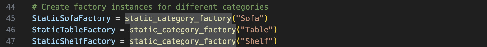

Add `Static{CategoryName}Factory` to `infinigen/assets/static_assets/__init__.py` so that we can import it later. Again, this step is already done for our example: 

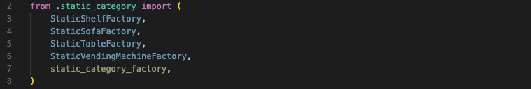

IMPORTANT: You must make sure that
1. The objects are a reasonable size. This is because there is no way for Infinigen to infer what the sizes of the objects should be, so it will use the sizes of external objects by default. If the objects are too big or too small, they will look out of place in the scene or Infinigen will fail to place them. To prevent this, you should specify what you want the dimensions to be in meters as we did with `z_dim = 2` above. You should specify only one dimension, and Infinigen will scale the object to satisfy that. 

2. The front of the object is facing +x, the back is facing -x, the bottom is facing -z, and the top is facing +z. You can do this by passing `rotation_euler = (x,y,z)` in Euler angles to `static_category_factory`. This information is important, for instance, when placing a sofa against the wall.

3. Make sure that `CategoryName` matches the name of the folder you created in the `static_assets/source` folder.

Here's an example of bad dimensions and orientation (left image); and good dimensions and orientation (right image):

<p align="center">
  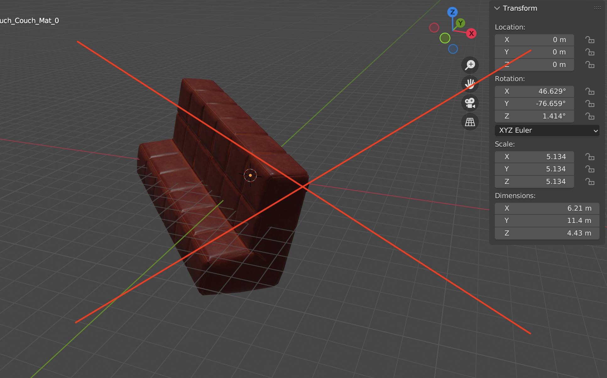
  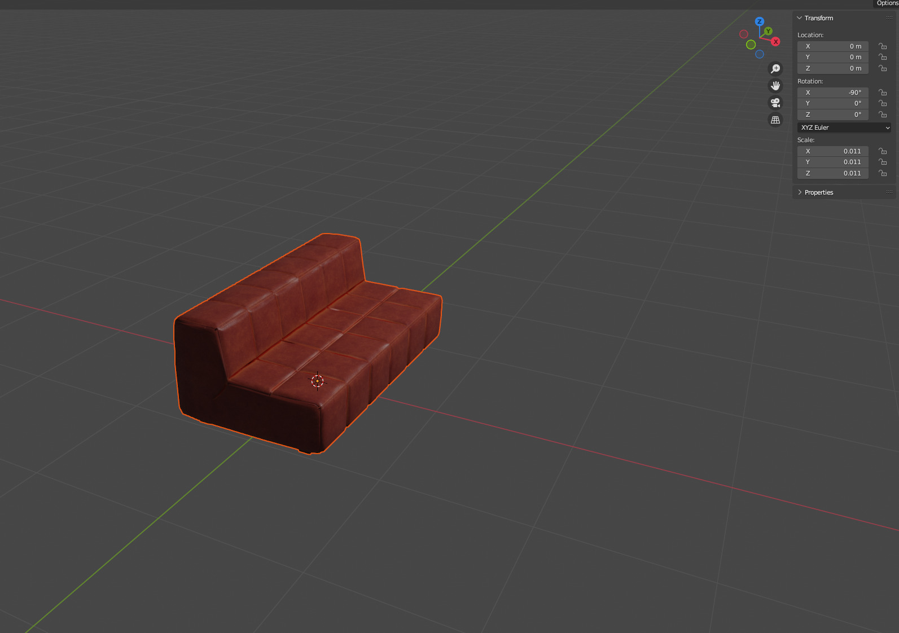
</p>


If you want to add more categories, just add more lines with `{CategoryName}` as the name of the category you want to import. 

## Define Semantics

Infinigen allows the user to specify high-level semantics for the objects in the scene. These semantics are then used to define high-level constraints. For example, we want to say that our static shelf factory is a type of storage unit, which will be placed against the wall, and there will be a bunch of objects on top of it. In general, if you want your static object factory to be treated like an existing asset factory, you can just imitate the semantics of the existing asset factory. Let's demonstrate this idea by defining semantics for our static shelf. We go to `infinigen_examples/indoor_asset_semantics.py` and search for `LargeShelfFactory`. We see that it is used as `Semantics.Storage` and `Semantics.AssetPlaceholderForChildren`. We want our static shelf to be used as a storage unit as well, so we add a line for our new static factory:
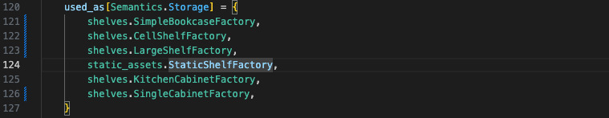

Similarly, we add `StaticShelfFactory` to `Semantics.AssetPlaceholderForChildren`. This will replace the placeholder bounding box for the shelf before placing the small objects. 
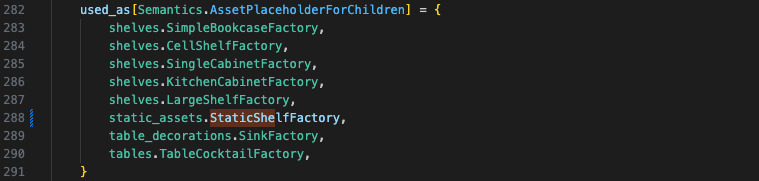

The semantics for the sofa and the table are analogous. We just define the same semantics as the existing asset factories that are similar to our static ones: 

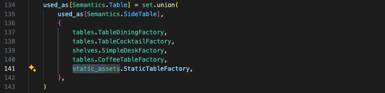

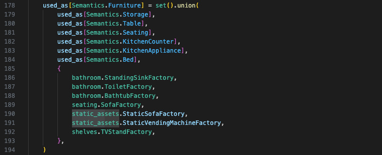

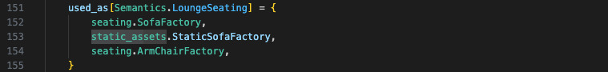

If your category is not similar to any existing category, you would need to think about it a little bit more and define your own semantics. For example, I found that the sofa semantics work well for vending machine as they are both placed against the wall, etc. 

## Add Constraints

The last step is to add constraints for our static assets. We want to make sure that the shelf is placed against the wall, the sofa is placed in the living room, and the table is placed in the dining room, etc. Luckily our new static assets are similar to existing assets, so we can just replace the existing constraints with our new static assets. We go to `infinigen_examples/indoor_constraint_examples.py` and search for `LargeShelfFactory`, `SofaFactory`, and `TableDiningFactory`. We just replace these constraints with our new static assets: 

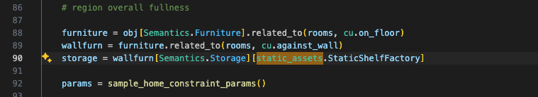

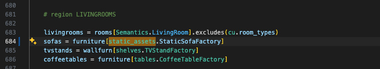

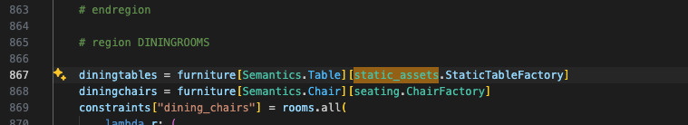

If you have some new asset that does not behave like any of the existing assets, you would need to define new constraints.


## Generate Scene

And, that's it! You can now generate a scene with your new static assets. We just use the regular Infinigen commands:

```bash
python -m infinigen_examples.generate_indoors --seed 0 --task coarse --output_folder outputs/indoors/coarse0 -g fast_solve.gin singleroom.gin -p compose_indoors.terrain_enabled=False restrict_solving.restrict_parent_rooms=\[\"LivingRoom\"\]
```

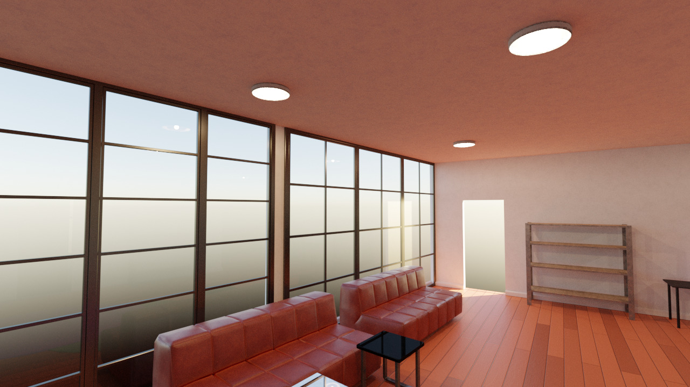

```bash
python -m infinigen_examples.generate_indoors --seed 1 --task coarse --output_folder outputs/indoors/coarse1 -g fast_solve.gin singleroom.gin -p compose_indoors.terrain_enabled=False restrict_solving.restrict_parent_rooms=\[\"LivingRoom\"\]
```
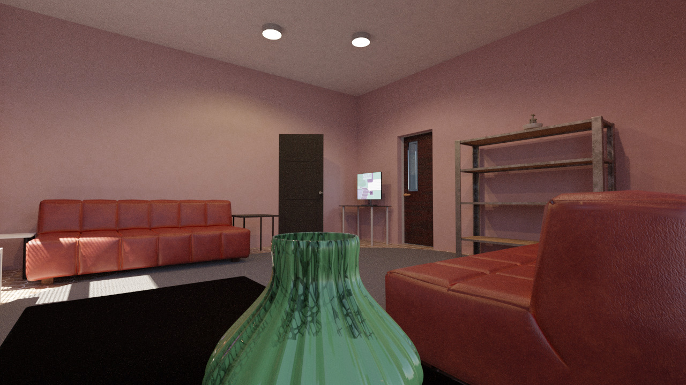

```bash
python -m infinigen_examples.generate_indoors --seed 11 --task coarse --output_folder outputs/indoors/coarse0dining -g fast_solve.gin singleroom.gin -p compose_indoors.terrain_enabled=False restrict_solving.restrict_parent_rooms=\[\"DiningRoom\"\]
```
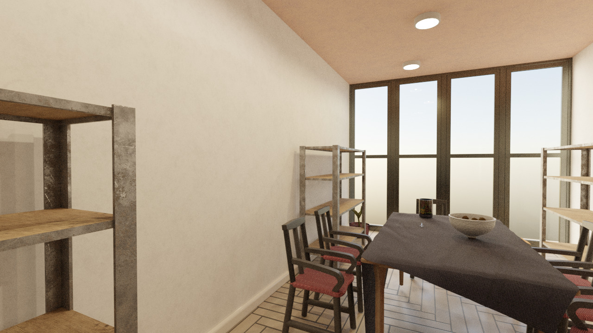

You can see that our new static assets are placed in the scene. What's more is that they interact with the existing Infinigen assets. For example, we have a bowl of fruit and a glass on top of the table. 

## Modify Objects with Code (Optional)

If you want to post-process the imported static objects or customize the object creation, you can define your own static category class similar to `StaticCategoryFactory` in `infinigen/assets/static_assets/static_category.py`. For instance, you can add a `finalize_assets(self, assets)` function to your class to post-process the imported assets. 

## Support Surfaces (Optional)

A shelf should have small objects placed on it. But, how can Infinigen know where to place these objects? The default is that the top surface of the object is used as the surface for placing objects. For instance, in the above example, we saw that some objects were automatically placed on the table even though we did not specify where to place them. A shelf has multiple surfaces, so we need to tag these surfaces as so-called "support surfaces". This is very easy to do in the case where the support surfaces are the distinct planes along the z direction, as is the case with shelves. We just enable the option `StaticShelfFactory = static_category_factory("Shelf", tag_support=True)` in `infinigen/assets/static_assets/static_category.py`:


Now when we generate the scene, we see that the objects are placed on all surfaces of the shelf:

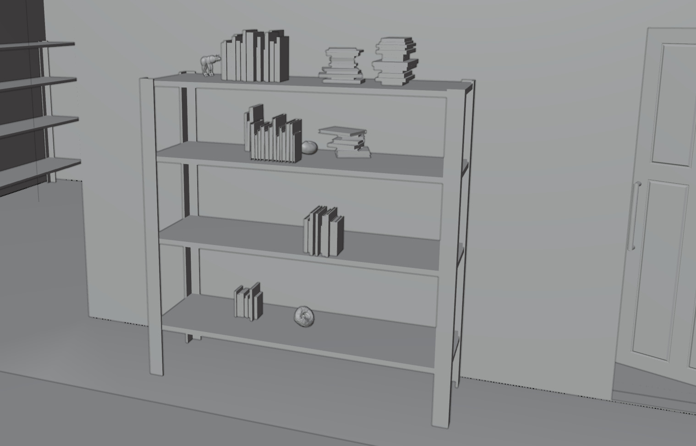

## Summary for arbitrary objects

Let us summarize all the steps you would need to follow to import arbitrary objects into Infinigen:

1. Download the objects in one of the supported formats.

2. Create a folder for this object category in `infinigen/assets/static_assets/source`. E.g.

```bash
mkdir infinigen/assets/static_assets/source/MyCategory
```

3. Place the downloaded objects in the folder you created.

4. Add a line in `infinigen/assets/static_assets/static_category.py` to define the factory for this category. E.g.
    
```python
StaticMyCategoryFactory = static_category_factory("infinigen/assets/static_assets/source/MyCategory")
```

5. Add a line in `infinigen/assets/static_assets/__init__.py` to import the factory from other files.

6. Define the semantics for the objects in `infinigen_examples/indoor_asset_semantics.py`. E.g.

```python
used_as[Semantics.Furniture] = {...
                                static_assets.StaticMyCategoryFactory}
```

7. Define the constraints for the objects in `infinigen_examples/indoor_constraint_examples.py`. E.g.

```python
my_cat_against_wall = wallfurn[static_assets.StaticMyCategoryFactory]
...
```

8. Generate the scene using the regular Infinigen commands.

## Some Other Examples

Now that you know how to import static assets, you can import all kinds of different objects. Here are some creative examples:

<p align="center">
  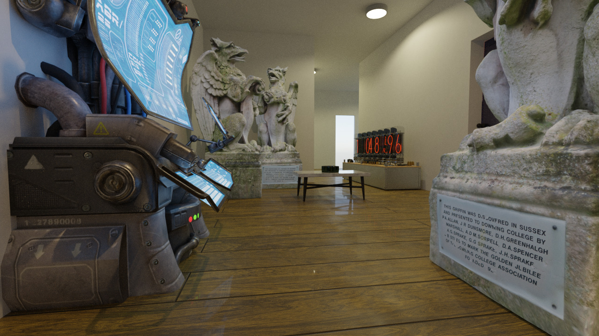
  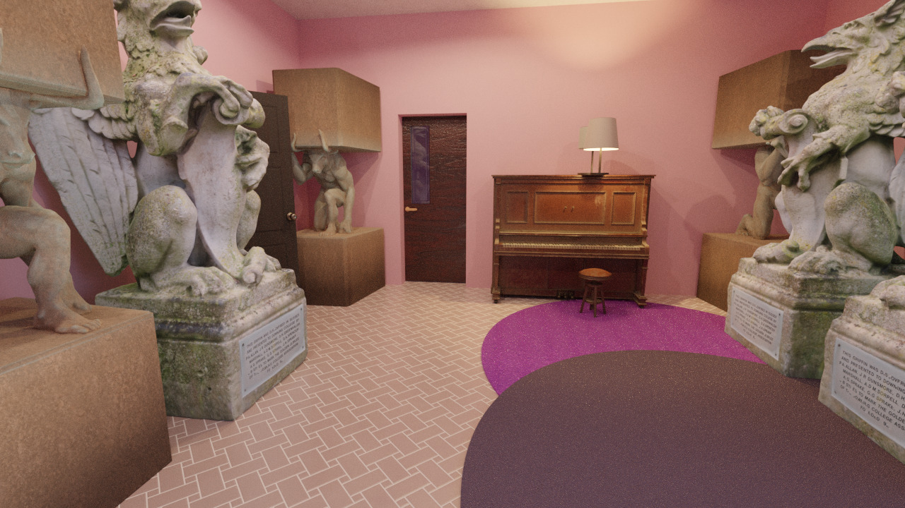
  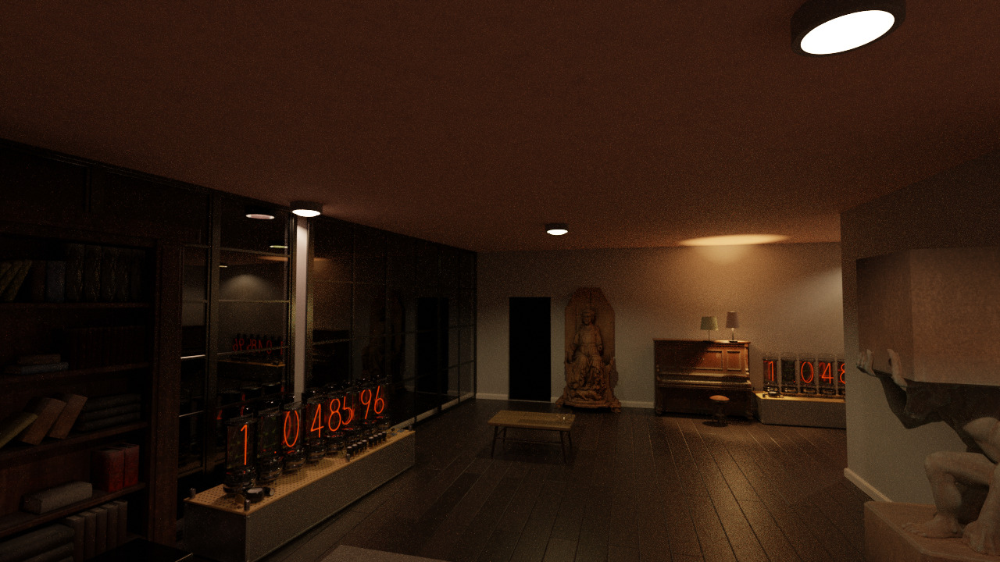
  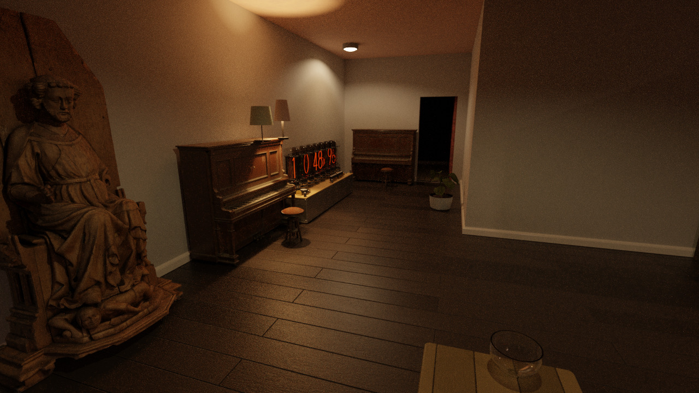
  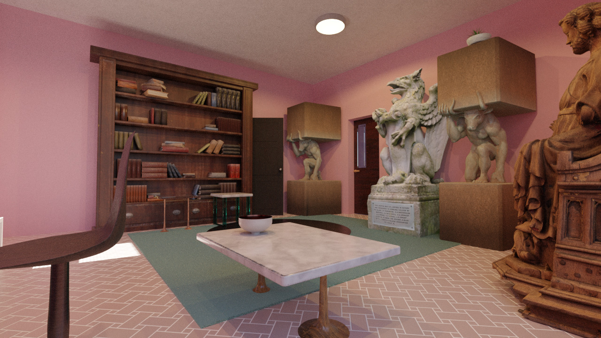
  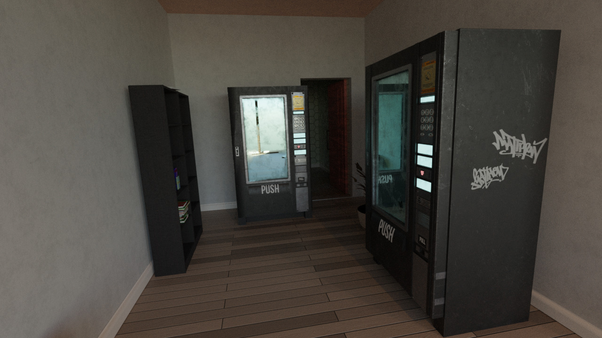
</p>

The external assets used here are: 

- [St Olaf](https://sketchfab.com/3d-models/st-olaf-the-patron-saint-of-norway-342b6866ba7c46449392acbe27217aa2) (Attributed to Historiska and is licensed under [CC BY 4.0](https://creativecommons.org/licenses/by/4.0/). We use this asset with modification, i.e. rendered image). 

- [Dusty Bookshelves](https://sketchfab.com/3d-models/dusty-bookshelfs-caaf76f4506f4b01a2dffb553bae9342) (Attributed to Meanphrog and is licensed under [CC BY 4.0](https://creativecommons.org/licenses/by/4.0/). We use this asset with modification, i.e. rendered image). 

- [Minotaur Statue](https://sketchfab.com/3d-models/minotaur-statue-d3f9aaecb7e94b12bc28256c85a40ce0) (Attributed to plasmaernst and is licensed under [CC BY 4.0](https://creativecommons.org/licenses/by/4.0/). We use this asset with modification, i.e. rendered image). 

- [Dusty Piano](https://sketchfab.com/3d-models/dusty-piano-fe58e81e5fa940319e79796e23053182) (Attributed to Vincent074 and is licensed under [CC BY 4.0](https://creativecommons.org/licenses/by/4.0/). We use this asset with modification, i.e. rendered image). 

- [Divergence Meter (Steins;Gate)](https://sketchfab.com/3d-models/divergence-meter-steinsgate-b43abf482d30435fa0683b765deee31b) (Attributed to Amatsukast and is licensed under [CC BY-NC-SA 4.0](https://creativecommons.org/licenses/by-nc-sa/4.0/). We use this asset with modification, i.e. rendered image). 

- [Stone Griffin](https://sketchfab.com/3d-models/stone-griffin-downing-college-cambridge-d94638d6c6ad4119b868567cf8e9fe2b) (Attributed to Thomas Flynn and is licensed under [CC BY 4.0](https://creativecommons.org/licenses/by/4.0/). We use this asset with modification, i.e. rendered image). 

- [Hologram Console](https://sketchfab.com/3d-models/hologram-console-bfbbb481e98e4be38774b1d0204c192c) (Attributed to TooManyDemons and is licensed under [CC BY 4.0](https://creativecommons.org/licenses/by/4.0/). We use this asset with modification, i.e. rendered image). 

- [vending machine](https://sketchfab.com/3d-models/vending-machine-fb0516c9c6954e5dbeb420aaa48059c0) (Attributed to wilsz95 and is licensed under [CC BY 4.0](https://creativecommons.org/licenses/by/4.0/). We use this asset with modification, i.e. rendered image). 