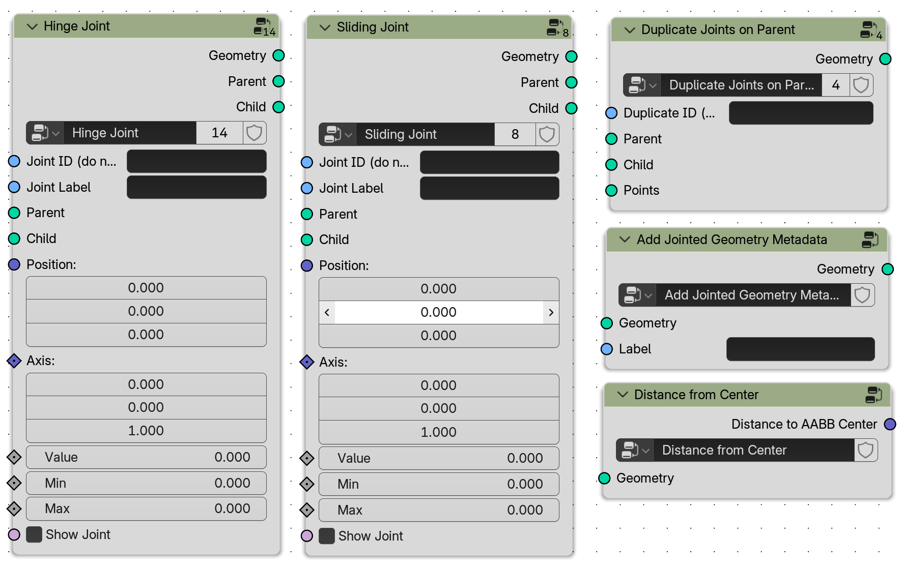
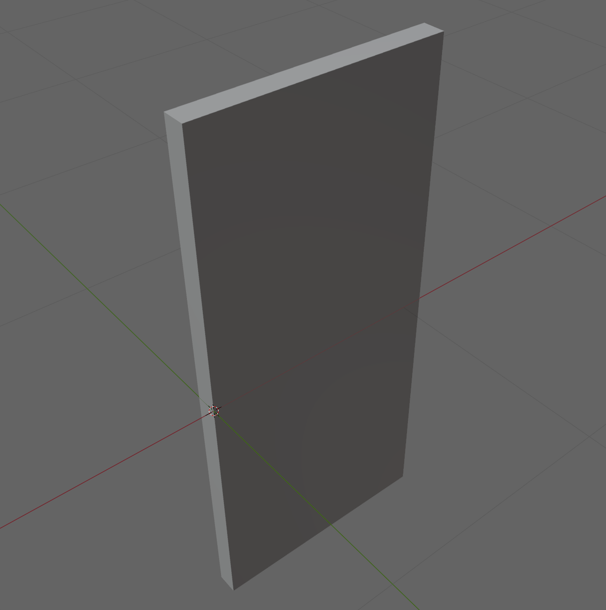
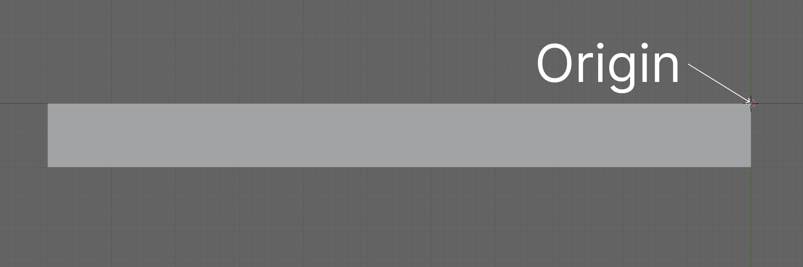
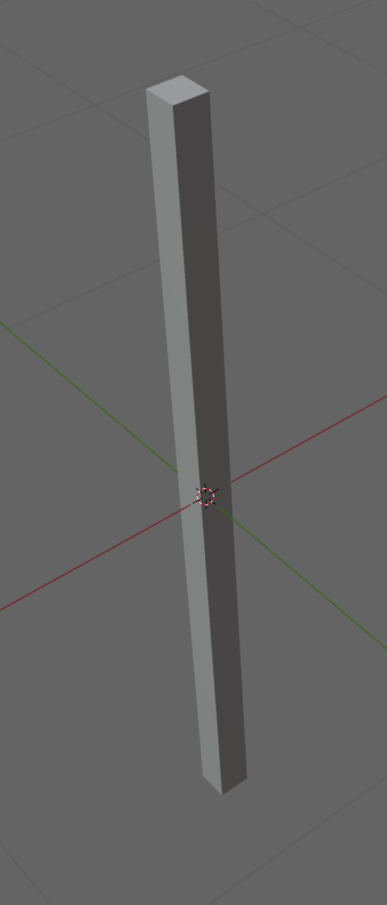
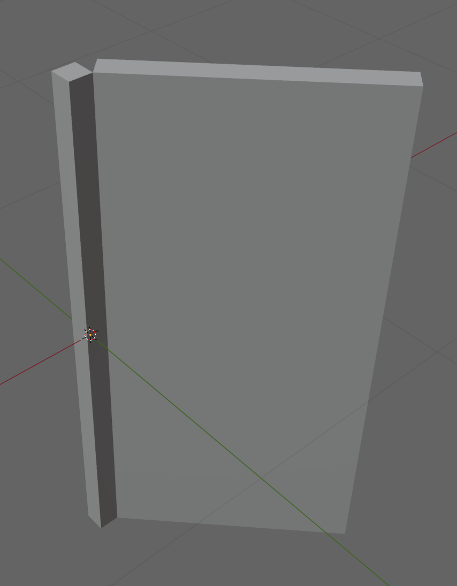
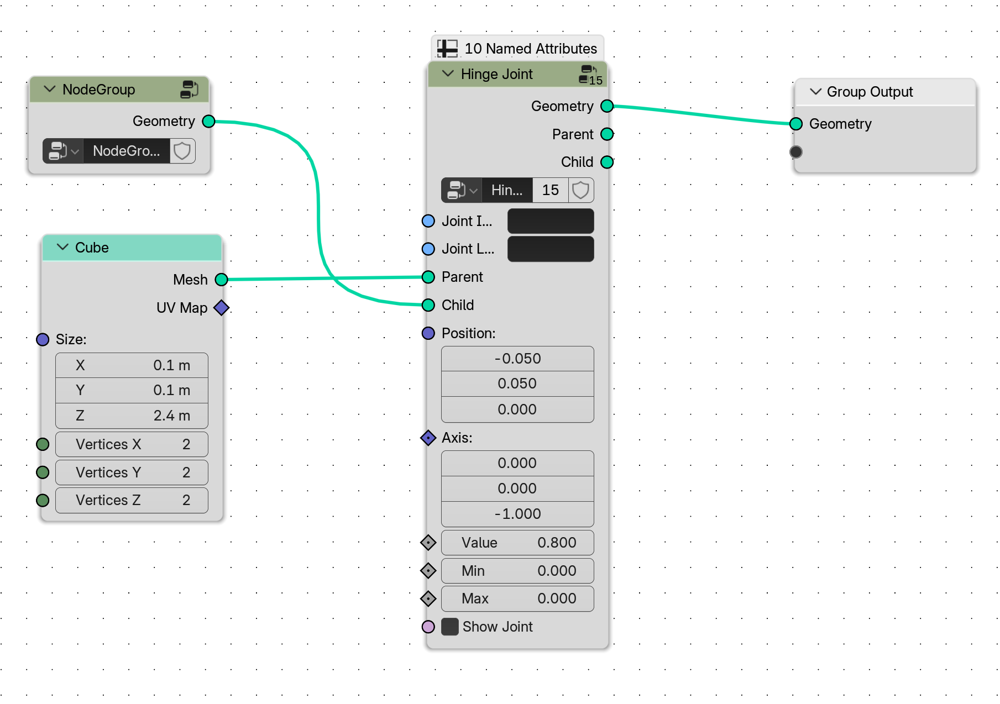

# Creating Custom Articulated Assets for Robot Simulation

‼️ Please read the documentation carefully as there are important requirements when creating custom articulated assets. We also include additional requirements if you wish to add your articulated asset to Infinigen.


## Creating an Articulated Sim-Ready Asset

To create a simulation-ready articulated asset using Blender Geometry Nodes, please use the provided custom joint nodes to connect and articulate parts of the object. There are a total of 5 utility nodes:
- **Hinge Joint**: Connects two geometries via a hinge joint and defines a parent-child relationship between the geometries.
- **Sliding Joint**: Connects two geometries via a sliding relationship and defines a parent-child relationship between the geometries.
- **Duplicate Joints on Parent**: Creates multiple instances of a particular jointed child body on its parent.
- **Add Jointed Geometry Metadata**: Adds semantic metadata to a particular part of the asset.
- **Distance from Center**: Calculates the distance from the input geometry’s top-most parent’s axis aligned bounding box center to its borders. This may come in handy when setting the position of the child geometry.




### How to use the Joint Nodes Correctly

Both joint nodes require parent and child input geometries. When using the nodes, a joint is defined at the origin of the child geometry. For example, let's say you want to create a simple door that is hinged on a frame. Let's first start by creating a simple box object to represent our door.





Notice that our door is transformed such that it is not centered at the origin. Instead, the origin is on one edge of the box. The origin serves as the attachment point of the child object. This makes child geometries hot swappable under the assumption that the origin is where the joint will effectively end up going.

Next, we will create the joint frame. The door frame can be located anywhere. For the purposes of this tutorial, we will assume our door frame is elongated box geometry.



Now that we have the frame and the door, let's add hinge joint to create an articulated door.




As shown, our door geometry goes into the child socket and the frame geometry goes in the parent socket. We also set the position of the joint. **IMPORTANT**: This position is relative to the center of the parent geometry's bounding box center. In the example above, the position would be relative to the center of frame's bounding box. After jointing, the child geometry is transformed such that its attachment point (i.e. its origin), is moved to the defined position. Our nodes also allow you to set the axis of the joint. 

## Joint Documentation

### Hinge Joint Sockets

**Inputs**
- Joint ID (do not set): Do not change anything here.
- Joint Label: Label of the joint. For instance, for the hinge joint connecting a door to the door frame, it can be called “door_hinge”
- Parent: The parent geometry for the jointed body. Changing the joint's value parameter does not affect the orientation of this geometry.
- Child: The child geometry for the jointed body. Changing the joint's value parameter rotates this geometry around the specified joint axis.
- Position: The position of the child body relative to the parent’s axis aligned bounding box center. Note that the hinge joint’s pivot position is assumed to be at the child geometry's origin. For an example, refer to the dummy door geometry in the simulation template file.
- Axis: The axis around which the rotation occurs.
- Value: The current rotational offset for the joint (in radians).
- Min: The minimum rotation value for the hinge joint. If specified, it must be less than the Max value.
- Max: The maximum rotation value for the hinge joint. If specified, it must be greater than the Min value.

**Outputs**
- Geometry: The combined geometry containing both the parent and child geometries, along with their relative rotation. 
- Parent: The parent geometry after the joint is applied. While the parent geometry itself remains unchanged, this output may be required if multiple joints exist between two geometries.
- Child: The child geometry after the joint is applied, including its rotational offset. Similar to the Parent output, this may be required for setups involving multiple joints between two geometries.

💡Note: If min and max are both set to 0.0, this means that there are no limits to the articulated asset.

### Sliding Joint Sockets

**Inputs**
- Joint ID (do not set): Do not change anything here.
- Joint Label: Label of the joint. For instance, for the sliding connecting a drawer to the frame, it can be called “drawer_joint”
- Parent: The parent geometry for the jointed body. Changing the joint's value parameter does not affect the orientation of this geometry.
- Child: The child geometry for the jointed body. Changing the joint's value parameter translates this geometry on the specified joint axis.
- Position: The position of the child body relative to the parent’s axis aligned bounding box center. 
- Axis: The axis about which the translation occurs.
- Value: The current translational offset for the joint (in radians).
- Min: The minimum translational value for the hinge joint. If specified, it must be less than the Max value.
- Max: The maximum translational value for the hinge joint. If specified, it must be greater than the Min value.

**Outputs**
- Geometry: The combined geometry containing both the parent and child geometries, along with their relative rotation. 
- Parent: The parent geometry after the joint is applied. While the parent geometry itself remains unchanged, this output may be required if multiple joints exist between two geometries.
- Child: The child geometry after the joint is applied, including its rotational offset. Similar to the Parent output, this may be required for setups involving multiple joints between two geometries.

💡Note: If min and max are both set to 0.0, this means that there are no limits to the articulated asset.

## Duplicate Joints on Parent Sockets

**Inputs**
- Parent: Parent geometry that should be the Parent output from a Hinge or Slide joint node.
- Child: Child geometry that should be the Child output from a Hinge or Slide joint node.
- Points: Points on which to place the child geometries. Each point will act as the origin to a child geometry. We create copies of child geometries on each of the points.
**Outputs**
- Geometry: Output geometry with the duplicated children elements on the parent body.

💡Note: Changing the value of a joint that has been duplicated will affect all duplicated geometries. This is purely for visualization purposes. Do not worry about separating values for each duplicated geometry as this will be handled by the simulation exporters.

## Add Jointed Geometry Metadata Sockets

**Inputs**
- Geometry: Input geometry to label.
- Label: Semantically meaningful label to attach to geometry.

**Outputs**
- Geometry: Same as input geometry, but now tagged with semantic label.

## Distance to Center Sockets

**Inputs**
- Geometry: Input geometry

**Outputs**
- Distance to AABB Center: Distance to the axis aligned bounding box center of the input geometry. This node is especially useful when defining the attachment point on the parent's geometry.


To verify the joints, on the right side of the viewer open the “Joint” dropdown. Hit the spacebar to pause the simulation. Drag the joint bar to verify the object is moving correctly. You will not be able to drag the joint bar unless the simulation is paused.
Other Notes
Creating Multi-Jointed Articulations
Examples: soap dispenser nozzle

To create multi-jointed geometries (i.e. multiple degrees of freedom between two geometries), connect the parent and child outputs of a joint node to the parent and child inputs of the next node. 

## Integrating Articulated Assets into Infinigen
All assets must follow these rules to be successfully integrated into Infinigen-Sim:
- Each articulated part must have its own node group. Joint nodes should only be at the top most level of the node graph. Additionally, you should not deform the object’s topology after jointing two parts together. While Blender may allow for this, it is important that you do not change the geometry after using any joint nodes. Only translating and rotating is allowed.
- The default state of the asset (i.e. when it is not being interacted) must be when all the joint values equals 0. The max/min values of the joint must be when the asset is being interacted with.

To verify that your asset successfully exports to simulation. Follow these steps:

- First, run `python scripts/transpile_sim.py -bp {path to blend file} -bon {name of object in blender file}`

- If the transpile process is successful, verify two things:
    - An asset transpiled .py was successfully created under infinigen/assets/sim_objects
    - The asset was added to the mapping in infinigen/assets/sim_objects/mapping.py

- Add logic to sample the parameters for your asset. You should edit the sample_parameters function and return a dictionary where the keys correspond to the input parameter name and the values are the values for that particular parameter.

- Next, spawn a sim ready asset by running `./scripts/spawn_sim_ready_asset.sh {asset_name} 1 mjcf`
- If successful, this should print the path to an XML file (“Exported to …/door.xml”). To verify this asset is correct in sim, run the following command `python -m mujoco.viewer --mjcf={path to outputted xml}`
- If the asset works, you might see it completely gray at first in the viewer. This is because these are the collision meshes. To turn these off, open the “Group enable” drop down on the left hand side and deselect “Group 0”


In addition to rules listed above, make sure to verify your simulation asset using our unit tests and visualizer. More information can be found [here](VerifyingSimAssets.md) and [here](VisualizingArticulatedAssets.md). Once you have verified your asset works, create a PR to Infinigen.

You may also find it helpful to create aliases for transpiling and spawning assets.

```
alias transpilesim='{PROJECT_ROOT}/scripts/scripts/transpile_sim_ready_asset.sh'
alias spawnsim='{PROJECT_ROOT}/scripts/scripts/spawn_sim_ready_asset.sh'
```