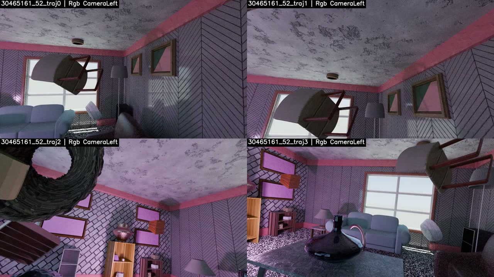

# infinigen2 examples

Each example is a single standalone script that renders a multi-pass video dataset with `infinigen2`. Each example script is extremely customizeable. You can call additional object / scene generators from the docs, change what ExportTypes are rendered, or add additional rendering steps with objects or settings changed.

## flying_indoor [[source]](https://github.com/princeton-vl/infinigen/blob/main/examples/flying_indoor/render.py)

A stereo video of a furnished room with animated floating objects and lights, with ground truth for the left camera. Renders a fixed 24-frame `1280x720` clip.

[](https://www.youtube.com/watch?v=a9VPKJofFo8)

▶ [Watch the 2.0.0a2 flying-indoor video](https://www.youtube.com/watch?v=a9VPKJofFo8) &nbsp;|&nbsp; 📦 [**Download pregenerated data for this setting here!**](https://huggingface.co/datasets/infinigen/infinigen2-flying-indoors)

If you wish to generate data similar to the video or datarelease, you must install `infinigen==2.0.0a2`. Otherwise, you will produce data from a newer version, possibly with different objects and materials, but still matching the overall design of flying objects in an indoor room.

This example is grouped under `examples/flying_indoor/`:

- `render.py` — the render script.
- `cvdpack.json` — the [cvdpack](https://github.com/princeton-vl/cvdpack) config that packs a rendered clip into per-camera videos.
- `sbatch.sh` — a SLURM array script that renders, packs, and offloads a dataset.

To render a single camera locally, please run:
```bash
uv run python examples/flying_indoor/render.py --seed 0 --camera_idx 0 --trajectory_seed 0 --output outputs/flying_indoor
```

- `--seed` is the random seed used to determine the base 3D scene (including objects, materials, lights, layout).
- `--trajectory_seed` is the random seed used to determine only the camera trajectory. Changing this seed re-randomizes the trajectory without affecting the base 3D scene.
- `--camera_idx {0,1}` chooses which stereo camera to render (0 = left, 1 = right). You must run render.py twice for each seed pair (`seed` and `trajectory_seed`) to get stereo data.

By running both `camera_idx` for a single seed pair, you will receive the following data:
- **left** — rgb + `camera.npz`, plus `material-index`, `diffuse-color`, `environment` passes.
- **right** — rgb + `camera.npz`.
- **left gt** — `depth`/`surface-normal`/`object`/`optical-flow` `.npy`.
- **right gt** — `depth` `.npy`.
- `metadata.json` (seed, per-pass runtimes, exports), written by the left-camera shard.

To render a dataset on SLURM, `sbatch.sh` runs one array task per `(scene, trajectory, camera)`, with `NUM_TRAJECTORIES` unique trajectories per scene (default 4). Each task renders raw frames to fast local `SCRATCH_DIR`, packs them with cvdpack, and offloads only the compressed videos to `FINAL_DIR`, then deletes the raw frames:

```bash
sbatch examples/flying_indoor/sbatch.sh
```

💡 Edit the hardcoded `SCRATCH_DIR` (node-local scratch) and `FINAL_DIR` (permanent storage) at the top of `sbatch.sh` to suit your cluster, size `--array` as `N_SCENES * NUM_TRAJECTORIES * 2`, and adjust `--partition`/`--account`/other SLURM configs.

## panning video of clay-material scenes [[source]](https://github.com/princeton-vl/infinigen/blob/main/examples/render_clay_pan_video.py)

A linear camera pan of a livingroom, rendered in several passes: clay, ambient occlusion, rgb, and ground truth.

```bash
wget https://raw.githubusercontent.com/princeton-vl/infinigen/main/examples/render_clay_pan_video.py
uv run python render_clay_pan_video.py --seed 0 --output outputs/clay_pan_video
```

Each pass writes `%c/<name>-%f.png` under `--output` (`%c` = camera, `%f` = frame):

- **clay-flat** + **ao-flat** — undisplaced mesh (`DisplacementMode.NONE`), with a camera-parented fill light.
- **clay** + **ao-disp** — displaced mesh (`DISPLACEMENT_AND_BUMP`); fine surface detail shows up in the AO pass.
- **rgb** — full materials, plus `camera.npz`.
- **gt** — `depth`/`surface-normal`/`object`/`optical-flow` `.npy`; skipped with `--skip_gt`.
