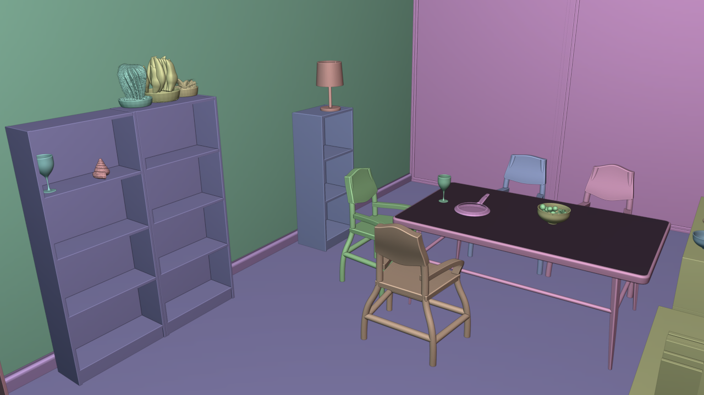
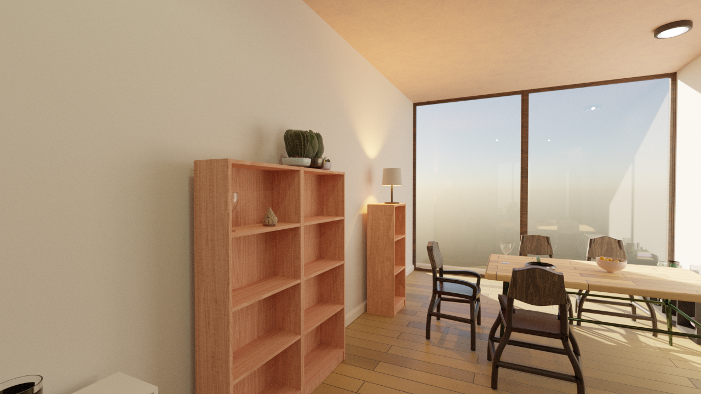
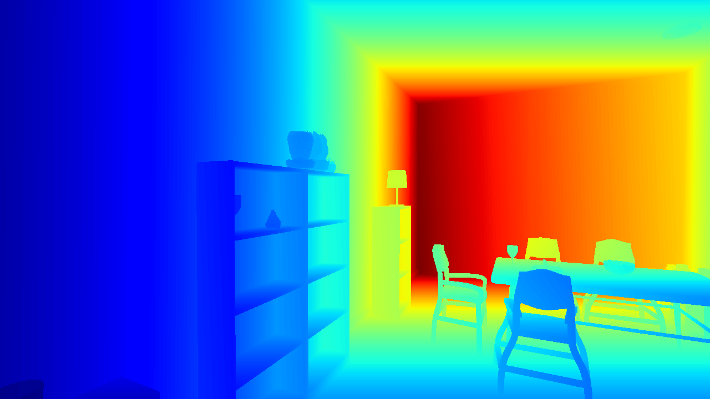
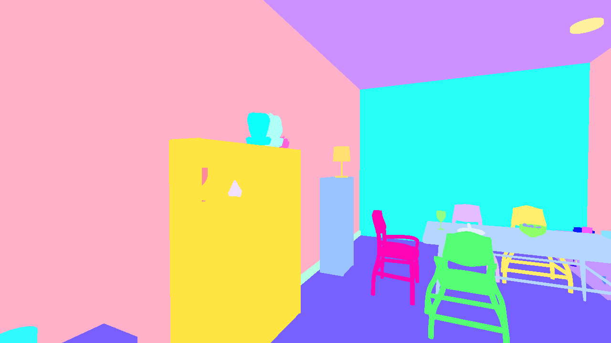
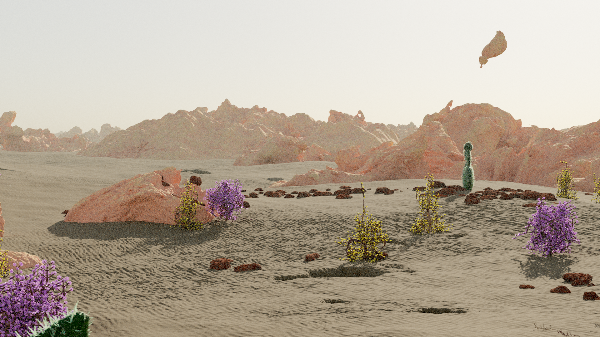
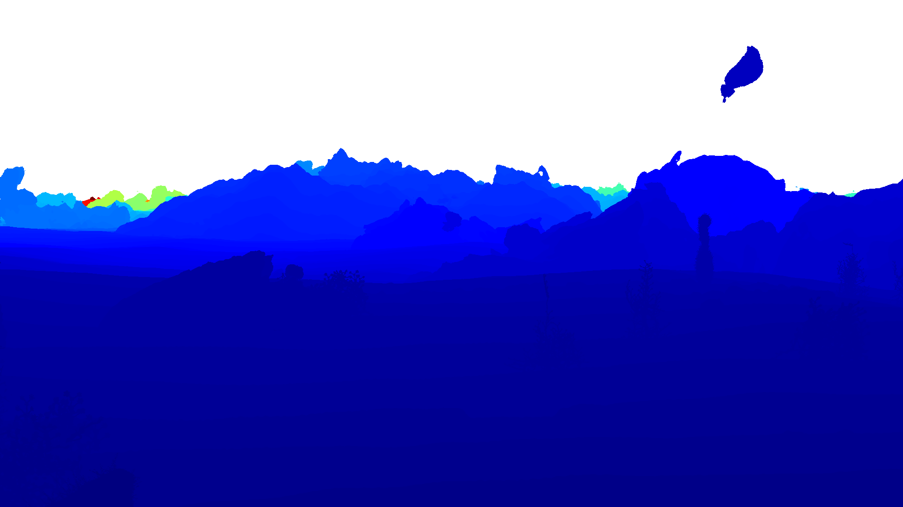
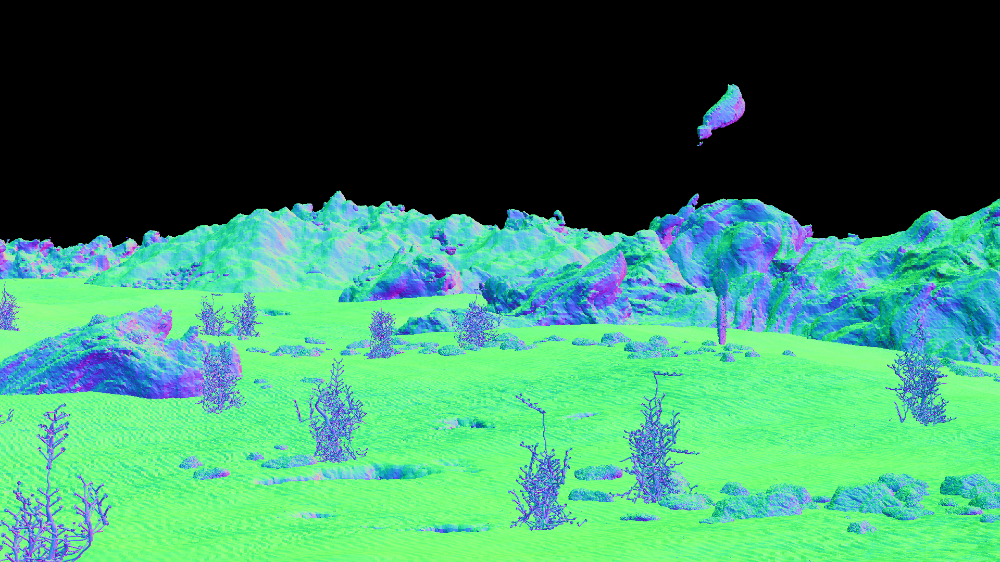
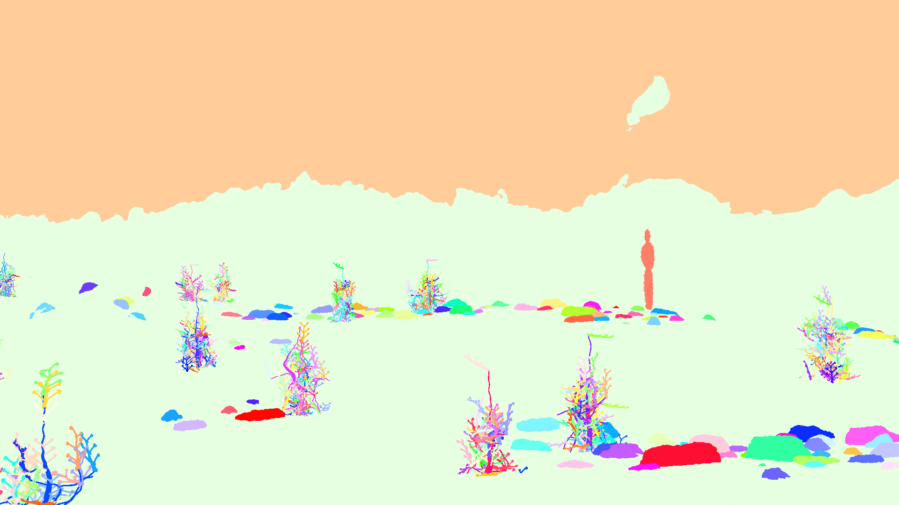

# Getting Started

```{include} ../../README.md
:start-after: "# [Infinigen: Infinite Photorealistic Worlds Using Procedural Generation](https://infinigen.org)"
:end-before: "### Generate Articulated Sim Assets: Getting Started with Infinigen Articulated"
```

### Generate Articulated Sim Assets: Getting Started with Infinigen Articulated

<p align="center">
  
</p>

See Installation and Exporting-to-Simulators instructions on our [articulated-stable](https://github.com/princeton-vl/infinigen/blob/articulated-stable/README.md) version, or on [initial release](https://github.com/princeton-vl/infinigen/blob/articulated-initial/README.md) or [latest](./ExportingToSimulators.md)

### Hello Room: Getting Started with Infinigen Indoors

<p align="center">
  
  
  
  
</p>

See Installation and Hello-Room instructions on our [indoors-stable](https://github.com/princeton-vl/infinigen/blob/indoors-stable/README.md) version, or on [initial release](https://github.com/princeton-vl/infinigen/blob/indoors-initial/README.md) or [latest](./HelloRoom.md)

### Hello World: Getting Started with Infinigen Nature

<p align="center">
  
  
  
  
</p>

See Installation and Hello-World instructions on our [nature-stable](https://github.com/princeton-vl/infinigen/blob/nature-stable/README.md) version, or on [initial release](https://github.com/princeton-vl/infinigen/blob/nature-initial/README.md) or [latest](./HelloWorld.md)

```{include} ../../README.md
:start-after: "or [latest](docs/HelloWorld.md)"
:end-before: "## Documentation"
```

## Documentation

- [Installation Guide](./Installation.md)
- ["Hello World": Generate your first Infinigen-Nature scene](./HelloWorld.md)
- ["Hello Room": Generate your first Infinigen-Indoors scene](./HelloRoom.md)
- [Configuring Infinigen](./ConfiguringInfinigen.md)
- [Configuring Cameras](./ConfiguringCameras.md)
- [Downloading pre-generated data](./PreGeneratedData.md)
- [Generating individual assets](./GeneratingIndividualAssets.md)
- [Exporting to external fileformats (OBJ, OpenUSD, etc)](./ExportingToExternalFileFormats.md)
- [Add external assets to indoor scenes](./StaticAssets.md)
- [Extended ground-truth](./GroundTruthAnnotations.md)
- [Implementing new materials & assets](./ImplementingAssets.md)
- [Generating fluid simulations](./GeneratingFluidSimulations.md)
- [Exporting to physics simulation](./ExportingToSimulators.md)

Please see our [project roadmap](https://infinigen.org/roadmap) and follow us at [https://twitter.com/PrincetonVL](https://twitter.com/PrincetonVL) for updates.

```{include} ../../README.md
:start-after: "for updates."
```
