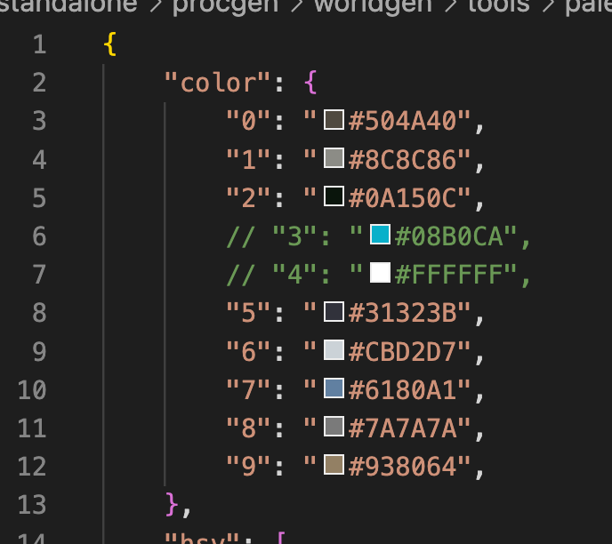

# How to use

This palette generating tool is enabled using `GoogleImagesSearch` (currently using Zeyu's API key). 

Please `pip install google-images-search==1.4.4 json5` ontop of Infinigen's usual dependencies.

## Step 1

```
cd infinigen/tools/terrain/palette/
# you can change "mountain rock" to other key words
python palette.py -k "mountain rock"
```

This downloads 10 images from Google by default:


and runs Mixed Gaussian Model (MGM) on HSV space to get an initial palette:


You can see the above palette in folder `images`. By default it has 10 centers, and the first row is the color of all centers, and the second row is the range of color when you vary it according to MGM with range (-std, std) (V dimension is ommited for 2D display)

Some colors are background colors and do not belong to the keyword you search.

## Step 2

Under folder `json`, there is a `mountain rock.json`. By installing Add-on `Flutter Color` and `JSON5 syntax` in VSCode, you can see the color icon. 


After manually comemnt out them, you have:



Then you move the ready palatte to location: `infinigen/infinigen_examples/configs/palette`

## Step 3

When you want some color to sample from it, use the `palette` keyword in parameter parsing, e.g.:

```
assets.materials.water.shader.color = ("palette", "water")
assets.materials.ocean.shader.color = ("palette", "water")
assets.materials.mountain.shader.color = ("palette", "mountain rock")
assets.materials.sand.shader.color = ("palette", "desert")
assets.materials.sandstone.shader.color = ("palette", "sandstone")
```

Note that Blender uses lienar RGB while web content uses sRGB, so a conversion is done in the parsing function `random_general`