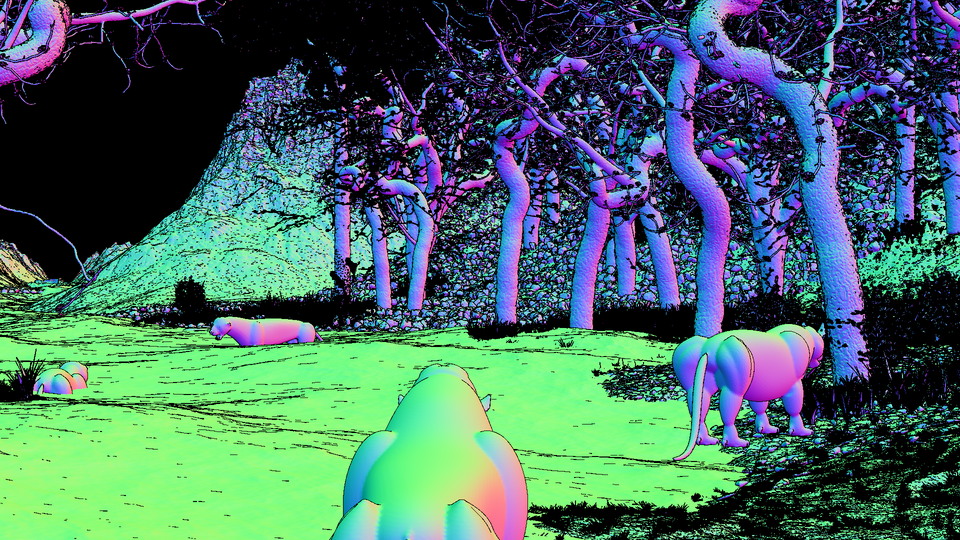

## Instructions (for linux server)

1. Run `git submodule update --init` in the infinigen repo to ensure the dependencies are populated

2. Start an interactive GPU job and cd into `infinigen/process_mesh`

3. Configure CMAKE by running
    ```
    /usr/bin/cmake -S . -Bbuild -DCMAKE_C_COMPILER=/usr/bin/gcc -DCMAKE_BUILD_TYPE=Release
    ```
    which should print
    ```
    -- The C compiler identification is GNU 8.5.0
    -- The CXX compiler identification is GNU 8.5.0
    -- Detecting C compiler ABI info
    -- Detecting C compiler ABI info - done
    -- Check for working C compiler: /usr/bin/gcc - skipped
    -- Detecting C compile features
    -- Detecting C compile features - done
    -- Detecting CXX compiler ABI info
    -- Detecting CXX compiler ABI info - done
    -- Check for working CXX compiler: /usr/bin/c++ - skipped
    -- Detecting CXX compile features
    -- Detecting CXX compile features - done
    -- Found ZLIB: /usr/lib64/libz.so (found version "1.2.11")
    -- Found OpenGL: /usr/lib64/libOpenGL.so found components: OpenGL EGL GLX
    -- Configuring done
    -- Generating done
    -- Build files have been written to: infinigen/process_mesh/build
    ```

4. Build the program
    ```
    /usr/bin/cmake --build build --target all
    ```

5. Run a test
    ```
    ./build/process_mesh --height 1080 --width 1920 -out output_images -in /path/to/examples/INTVFSGK/frames_INTVFSGK_resmpl0
    ```

    or to just check if OpenGL/EGL is working correctly, run

    ```
    ./build/process_mesh -in x -out x --height 100 --width 100
    ```
    which should print `ERROR: "x" does not exist.`

## Arguments

```
--width                     Image Width
--height                    Image Height
--input_dir                 Input frames directory
--output_dir                Output directory
--line_width                Width of occlusion boundaries, in pixels [default: 2]
--subdivide                 How many depth samples per-pixel (squared) for fitting normals [default: 2]
--normal_receptive_field    Radius of plane for fitting surface normals, in pixels [default 1]
```

## Other useful info

To download EGL on Ubuntu
```
sudo apt-get install libglfw3-dev libgles2-mesa-dev
```
